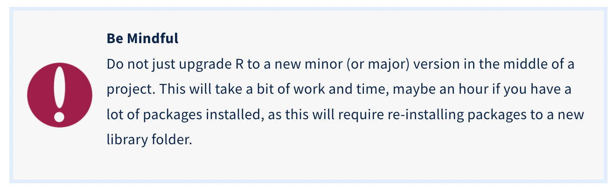
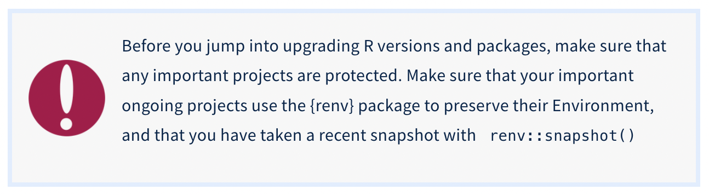

# R and RStudio Installation {#r}

## Install R 

**R** is a programming language and environment used for statistical computing and grahics. For more information, please visit [What is R](https://www.r-project.org/about.html).

To install R, visit [cloud.r-project.org](https://cloud.r-project.org/) to download the most recent version for your operating system.

Would you like a visual guide for install R and R Studio? Check out this YouTube R for Ecologist 

### Updating R

If you already have R installed, you may want to update the version of R you are using. Usually this occurs with a major version upgrades versus minor updates. 

**Please be aware that when you update R, it means re-installing all of the packages you have previously installed.** It is worth updating R when major updates are released, especially if new packages you are attempting to install are not compatible with the version of R currently installed. 

In order to update R, you have to find your installed version of R and run it on its own, outside of RStudio. This is easy if you have an R desktop shortcut, but not too hard if you hunt around a bit in your Applications folder. 

```{r rupdate, echo = F, auto_pdf = TRUE, fig.align = 'left', fig.height = 3, fig.alt="Caution message: Do not just upgrade R to a new minor (or major) version in the middle of a project. This will take a bit of work and time, maybe an hour if you have a lot of packages installed, as this will require re-installing packages to a new library folder."}


```


*Please see details below in Section 2.1.2 to save all R packages currently installed PRIOR to updating R, so you won't have to reinstall them individually after the update*

Double click the R icon to start up R. It will open the R Console and a menu. Click on the R menu at top left, and select Check for R Updates. If you are up to date, the R Console will report “Your version of R is up to date”. If not, this process will provide windows and buttons to click to upgrade to the latest version of R. When done, quit R and start RStudio to make sure the update has carried over. You should see the new version number when RStudio starts.

### Bulk Save R Packages Prior to Updates

In order to follow the bulk save R package instructions, you will need to have R Studio installed, and be familiar with the terminal and console panels.**

```{r renv, echo = F, auto_pdf = TRUE, fig.align = 'left', fig.height = 3, fig.alt="Caution message: Before you jump into upgrading R versions and packages, make sure that any important projects are protected. Make sure that your important ongoing projects use the {renv} package to preserve their Environment, and that you have taken a recent snapshot with renv::snapshot()"}


```

Before updating R, check out where your current package library is saved by entering `.libPaths()` in the console of RStudio. This should look something like: `[1] "/Library/Frameworks/R.framework/Versions/4.2/Resources/library"`

Note that this package library is specific to the most recent major and minor version of R. If you upgrade from 4.1.x to 4.2.x, you will have a new library path to a new 4.2 folder, and will need to re-install packages in this folder.

You can do this from scratch, and install packages individually as needed (which is not a bad way to clean out packages you are not using), but you may prefer to re-install all packages in an organized way, rather than  when you need to use one

You can see a dataframe of all currently installed packages by running the base R function `installed.packages()` in the R Studio console. This will help make a list of packages prior to updating R.

There is also a package for **Windows**, {installr}, which will pull the list of your current packages and install these in the correct folder for the new version of R. If you are on a Windows OS, and have installed the {installr} package, the `installr::updateR()` command in the console performs the following:

- finding the latest R version
- downloading it
- running the installer
- deleting the installation file
- copy old packages to the new R installation
- updating old packages as needed for the new R installation

But for MacOS and UnixOS folks, this must be done manually.

#### Saving a List of R Packages Manually

The short script below will save a vector of your current packages to a file in your root (home) directory, named `installed.packages.rda`. Copy this code chunk below into your Console pane in RStudio and run it. Then reopen RStudio, go to the Files tab, click on Home , and check your root (home) directory for the installed.packages.rda file. You can click on this file to load it into your Environment tab (answer yes to load). In your Environment tab, it should look like a character vector with the names of all of your packages in quotes.


```{r, echo=TRUE, eval=FALSE}
# save list to tmp as a matrix object
tmp = installed.packages() 

# filter for all rows where the "Priority" column is NA, and select just (column 1) the package names in quotes, and then assign this vector to the installedpackages object
installedpackages = as.vector(tmp[is.na(tmp[,"Priority"]), 1]) 

# save this vector as an *.rda file in your root (home) directory
save(installedpackages, file="~/installed_packages.rda") 

# remove the tmp matrix and the installedpackages vector from your Environment
rm(tmp)
rm(installedpackages)

```

Now that you have your saved list of packages stored in a file, you are ready to upgrade R. Quit RStudio, and go to [r-project.org](https://www.r-project.org/). 


#### Reinstalling list of R Packages

First, let’s check your new R version with `R.Version()` - run this in the Console pane. This should be the new version.

Now let’s check your library path with `.libPaths()` - run this in the Console Pane - this should match your R version.

Now run `installed.packages()`. This should show that your new library is mostly empty, except for the base R packages. We will now fix that.

Now you need to take advantage of your nicely-stored list of packages to reinstall all of your packages in your new (mostly empty) library.

Use the short script below to load the file `installed.packages.rda` to open a vector of your previous packages in your Environment pane, and then re-install all of these packages. Copy the code chunk below into your Console pane in RStudio and run it. This will take a while, especially if you have a lot of packages installed.

While you are waiting, check out the code chunk below. The first step is to load the installedpackages.rda file from your root (home) directory into your Environment pane. Then it starts taking action on this vector of package names. See what it does in the next step, the for loop, and think about how it works. - It measures the length of the vector, installedpackages. - Then it counts from 1 to the length of installedpackages. - For each count, it installs the package at position [count] in the vector - Then it goes to the next [count] value, and installs the next package in the vector - Until it reaches the full length of the vector (installs the last package), and then stops.

```{r, echo=TRUE, eval=FALSE}
# loads vector into your Environment pane
load("~/installed_packages.rda")

# For each package in this vector of length [count], install them one by one until the last one is installed.

for (count in 1:length(installedpackages)) {
    install.packages(installedpackages[count])
}
```


When all of the installation is complete, you can check your work  by running `installed.packages()` again in the R Studio console. You should see a full list of your packages, and you are updated and ready to go!


## Install or Update R Studio

RStudio is a software (considered an Integrated  Development Environment, or IDE) that provides R programmers with an easy-to-use interface for coding in R. 

**Note:** RStudio will not work without R installed, and you won’t particularly enjoy using R without having RStudio installed. Be sure to install both!

- **New install:** To install RStudio, visit [rstudio.com/products/rstudio/](https://www.rstudio.com/products/rstudio/). Download the free (“Open Source Edition”) Desktop version for your operating system. 

- **Update:** If you already have RStudio and need to update: Open RStudio, and under ‘Help’ in the top menu, choose ‘Check for updates.’ If you have the most recent release, it will return ‘No update available. You are running the most recent version of RStudio.’ Otherwise, you should follow the instructions to install an updated version.

Open RStudio (logo you’ll click on shown below). **If you are prompted to install Command Line Tools, do it.**

```{r rstudio, auto_pdf = TRUE, fig.align = 'center', fig.height = 6, fig.alt="Image of R Studio logo, which is a white captial R encased in a light blue circle."}

knitr::include_graphics("images/rstudio.png")
```


**Mac Users**

There may be a need to install command line tools and [XQuartz](https://www.xquartz.org/):

- To install command line tools (if you’re not automatically prompted), run in the Terminal tab in RStudio: `xcode-select --install`

- Visit [xquartz.org](https://www.xquartz.org/) to download & install XQuartz.

### Update R Packages in R Studio

You will want to periodically update R packages to ensure you have the most up to date version. You can do this within RStudio by navigating via the Task Bar to `Tools/Check for Package Updates`. 

- Select All, and let the updates begin. 


## Install Quarto

*This is an optional tool within R Studio that is extremely powerful, but it is not required.*

Quarto is a scientific publishing tool built on Pandoc that allows R, Python, Julia, and ObservableJS users to create dynamic documents, websites, books and more.

As of *July 2022*, Quarto comes pre-installed in R Studio (v2022.07). If you haven't updated your R Studio IDE (and concerned about doing so), you can install Quarto separately. 

- Download Quarto [here](https://quarto.org/docs/get-started/) and install

- To use Quarto through the RStudio IDE, be sure to have at least version v2022.02 installed (see directions in step 2, above)

Learn more about Quarto [here](https://quarto.org/docs/get-started/hello/rstudio.html).

## Learn How to Use R & RStudio

There are many resources out there to help you learn how to use R and the RStudio IDE (YouTube, Googling, [StackOverflow](https://stackoverflow.com/), etc...). This is a short list of primary resources for you to reference. We encourage you to join R community Slack workspaces, R User community groups (such as [R-Ladies](https://rladies.org/)), and UC Riverside Data Science clubs!

- [ACM at UCR](https://acmucr.org/index.html) - UC Riverside community dedicated to technical, professional, and personal development in the context of computer science.
- [R for Data Science](https://r4ds.had.co.nz/)
- [R Markdown Cookbook](https://bookdown.org/yihui/rmarkdown-cookbook/)
- [Cookbook for R](http://www.cookbook-r.com/)
- [Advanced R](https://adv-r.hadley.nz/)
- [R Studio (posit) Book Catalog](https://www.rstudio.com/resources/books/)
- [R for Data Science Online Learning Community](https://www.rfordatasci.com/)
- [R OpenSci](https://ropensci.org/)
- [RStudio Cloud](https://rstudio.cloud/learn/primers) - interactive tutorials to learn data science basics.
- [R Studio Cheatsheets](https://www.rstudio.com/resources/cheatsheets/) - invaluable tool to learn how to use various R packages. 
- [Swirl](https://swirlstats.com/) - R package that is a built in tutorial.
- [Teacups, Giraffes, & Statistics](https://tinystats.github.io/teacups-giraffes-and-statistics/index.html) - an interactive tutorial to learn statistics and R coding, plus it is a beautiful!
- [Data Science in a Box](https://datasciencebox.org/)
- [Adventures in R](https://www.adventures-in-r.com/)
- [Data Analysis & Visualization in R for Ecologist](https://datacarpentry.org/R-ecology-lesson/)


