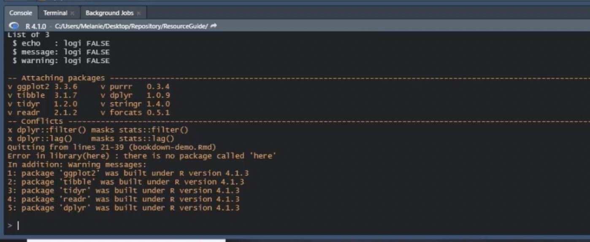
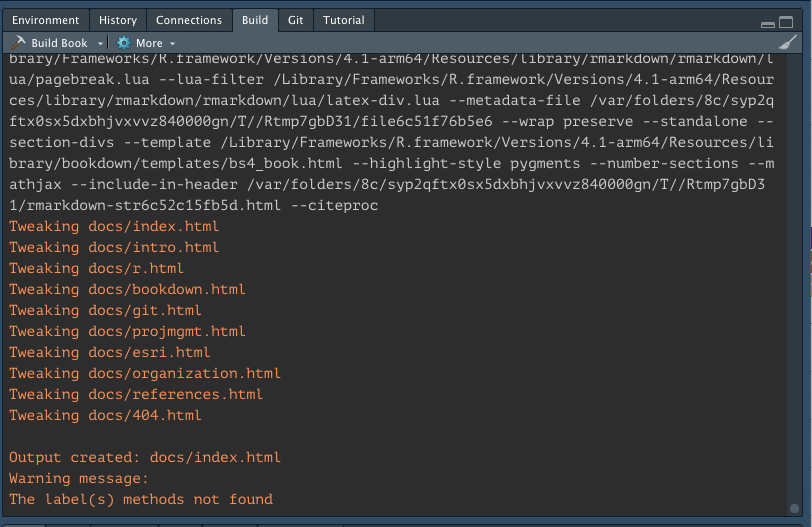
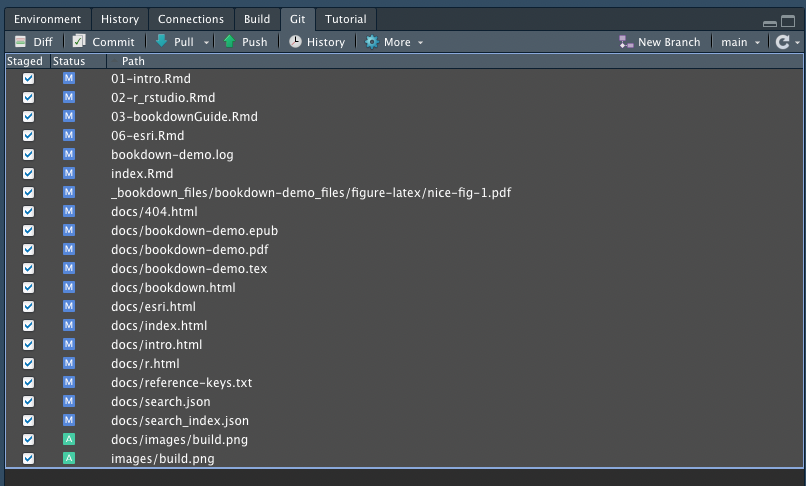
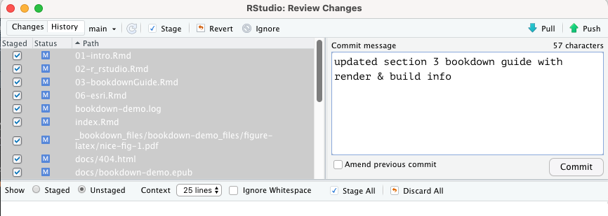

# Bookdown Guide {#bookdown}

This Resource Guide was created using the [`bookdown`](https://github.com/rstudio/bookdown) package. **bookdown** provides a platform to publish references using various output formats (PDF, HTML, Word) and allows for interactivity, insertion of code chunks, and supports a variety of languages (R, Python, Julia, SQL, etc.). 

## Primary Reference Resources

Here is a list of resources to learn how to use and edit in bookdown

- [Bookdown Package Documentation](https://bookdown.org/)
- [Authoring Books with R Markdown](https://bookdown.org/yihui/bookdown/)
- [R Markdown Cookbook](https://bookdown.org/yihui/rmarkdown-cookbook/)
- [R Markdown: The Definitive Guide](https://bookdown.org/yihui/rmarkdown/)

## Install the Bookdown package 
The first step to edit and add to this Resource Guide is to install the **bookdown** package from CRAN or Github. In the RStudio console, run the following:

```{r, eval=FALSE, echo = TRUE}
install.packages("bookdown")
# or the development version
# devtools::install_github("rstudio/bookdown")
```

### Additional packages

You may need to install additional packages if you do not currently have them in order to render the Resource Guide bookdown:

- `formatR`
- `here`
- `kableExtra`
- `Rtools`
- `shiny`
- `tidyverse`


### Install TinyTex

TinyTeX is a custom LaTeX distribution. LaTeX, which is pronounced «Lah-tech» or «Lay-tech», is a document preparation system for high-quality typesetting. It is most often used for technical or scientific documents. To learn more about TinyTex, [navigate to this document](https://yihui.org/tinytex/), and to learn more about LaTex, [visit the LaTex Project site](https://www.latex-project.org/).


To install TinyTex on your computer, navigate to the R Studio console panel, and type in the following command: 

`tinytex::install_tinytex()`


## Render, Build & Publish the Resource Guide 

When updates are made to the Resource Guide, it needs to be rendered, built, and then the updates published. 

In your Console, type either of these commands depending on which type of render you prefer:

`bookdown::render_book("index.Rmd", "bookdown::gitbook")`
`bookdown::render_book("index.Rmd", "bookdown::pdf_book")`

**Note:** If there is an error during rendering, Google what the error message means! You should be able to find an answer on [stack overflow](https://stackoverflow.com/) or other tech support site. One of the most common errors during rendering is that not all dependencies (aka packages) have been installed on your local computer. 

```{r rendererror, echo = F, auto_pdf = TRUE, fig.align = 'center', out.width= "95%", fig.cap="An common error message in the RStudio console: Error in library(here): there is no package called `here`. If you see this library error message, all you need to do is install the required package! The additional warning messages are notifications that R should be updated to be compatiable with the current packages. These will not hender the render."}


```

Once you have rendered updates using the console commands above:

- navigate to the **Environment, Connections, Build, Git** panel, 
- select the **Build** tab,
- select **Build Bookdown**
- once the build is complete (the final line should read `Output created: docs/index/html`), commit, pull and push updates to GitHub via the **Git** tab. 

```{r bookdown, echo = F, auto_pdf = TRUE, fig.align = 'center', out.width= "75%", fig.alt="environment panel in RStudio with the build tab selected"}


```


```{r gitselect, echo = F, auto_pdf = TRUE, fig.align = 'center', out.width= "75%", fig.alt="environment panel in RStudio with the build tab selected"}


```

```{r gitcommit, echo = F, auto_pdf = TRUE, fig.align = 'center', out.width= "75%", fig.alt="environment panel in RStudio with the build tab selected"}


```


__________________________________________________________________________________

**The following information is directly taken from the _bookdown_ package** [@R-bookdown].

## Formatting

You can use anything that Pandoc's Markdown supports, e.g., a math equation $a^2 + b^2 = c^2$.

### Referencing Bookdown Chapters
Remember each Rmd file contains one and only one chapter, and **a chapter** is defined by the first-level heading `#`.

You can label chapter and section titles using `{#label}` after them, e.g., reference this Resource Guide Chapter \@ref(intro) by using the markdown format: `\@ref(insert chapter label name here)`. If you do not manually label them, there will be automatic labels anyway, e.g., Chapter \@ref(methods).

### Formatting Figures
Figures and tables with captions will be placed in `figure` and `table` environments, respectively.

```{r nice-fig, fig.cap='Here is a nice figure!', out.width='80%', fig.asp=.75, fig.align='center'}
par(mar = c(4, 4, .1, .1))
plot(pressure, type = 'b', pch = 19)
```

Reference a figure by its code chunk label with the `fig:` prefix, e.g., see Figure \@ref(fig:nice-fig). Similarly, you can reference tables generated from `knitr::kable()`, e.g., see Table \@ref(tab:nice-tab).

```{r nice-tab, tidy=FALSE}
knitr::kable(
  head(iris, 20), caption = 'Here is a nice table!',
  booktabs = TRUE
)
```

### Citations

You can easily write citations using .bib files within this repository formatted using [BibTEX](http://www.bibtex.org/). For example, the **bookdown** package [@R-bookdown] in this reference book, which was built on top of R Markdown and **knitr** [@xie2015].

### Alt Text for Accessibility

[Use the knitr package to add alt text to graphics in R Markdown files](https://www.rstudio.com/blog/knitr-fig-alt/)

### Migrating to Quarto from Bookdown

Love `bookdown`? Check out `Quarto`! To learn how to convert `bookdown` documents to `Quarto`, check out this blogpost on [Openscapes](https://www.openscapes.org/blog/2022/07/21/quarto-migrate/) 


