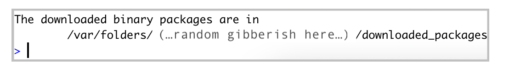
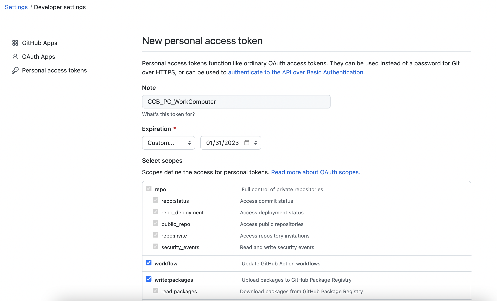
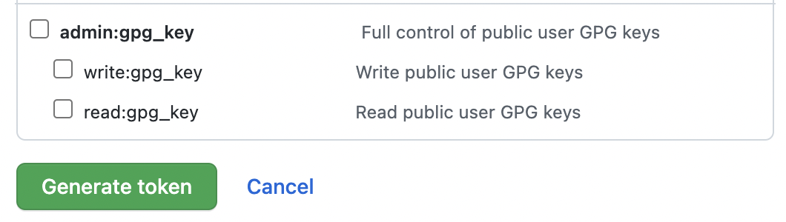
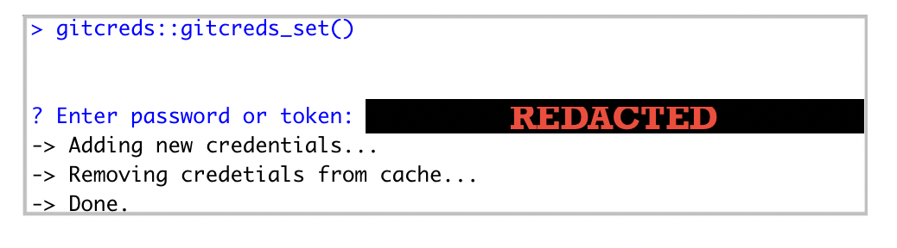
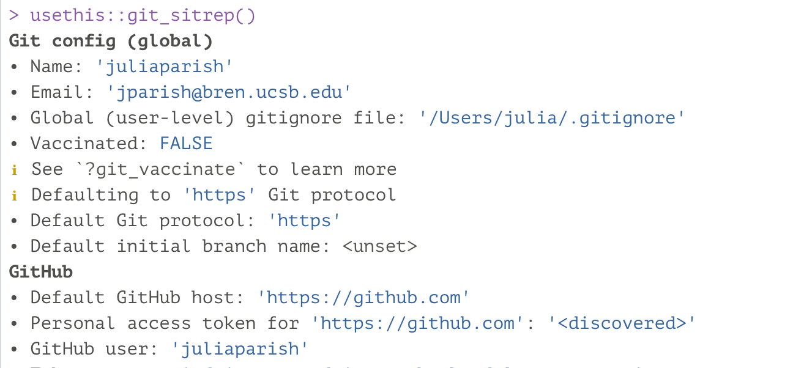

# Git Installation & GitHub Account {#git}

## GitHub

GitHub is a internet based code hosting platform for collaboration and [version control](https://www.atlassian.com/git/tutorials/what-is-version-control#:~:text=Version%20control%2C%20also%20known%20as,to%20source%20code%20over%20time.). GitHub lets you (and others) work together on projects. 

Navigate to [github.com](https://github.com/), and create an account! Please use either your work or personal email account. You can add several emails to your account, and assign a particular email as the primary email for the account. 

Review this article on choosing a GitHub username: [happygitwithr.com/github-acct.html](happygitwithr.com/github-acct.html). 

Want a cool Octocat icon for your GitHub account? Check out these icons:
- [Octodex](https://octodex.github.com/)
- [Build Your Own Octocat](https://myoctocat.com/)

Once you have created a GitHub account, join the [CCB's GitHub Organization](https://github.com/ccbucr). Please email the CCB PI to request they invite you to the organization. 

## Git 

Git is a tool utilized for source code management. It tracks changes and updates to code and allows for multiple users to work together within the same repository. Recommended reading for [background information on Git and its utility](https://towardsdatascience.com/what-is-git-and-why-is-it-so-important-dce559b27833) [@Yıldırım_2020].
 
Check to see if your computer already has git:

1. Open RStudio
2. In the terminal, run the following command:

  - `which git` (Mac, Linux)
  - `where git` (Windows)

If `git` is already installed, the return to the above command should return a filepath  similar to: 

  - MacOS `/usr/local/bin/git`
  - Windows `C:/Program Files/Git/bin/git.exe`

3. If there is no response, download and install `git` from here: [git-scm.com/downloads](https://git-scm.com/downloads). Select the default settings within the prompts **except** the default to **master** branch. This branch is being phased out, so select the option that let's you select alternative branches (ex: main).

Once Git is installed and your GitHub account has been set up, Git needs to be configured on the computer. Configuring Git is required to push & pull commits to GitHub. 

Configuring Git:

1. In RStudio, open the terminal. 
2. Run the following commands separately, pressing `Enter` after each line. Replace username and email with your GitHub account username and email. Make sure to keep the quotes around the username in the code below: 

  - `git config --global user.name "Jane Doe"`
  - `git config --global user.email janedoe@example.com`
  
3. Once you have entered the above command line code, check that the configuration was set correctly. In the RStudio Terminal, type the following command and hit enter:
  - `git config --list --global`
  
In the terminal, it should show code similar to this in the Terminal:

`user.name=janedoe`
`user.email=janedoe@ucr.edu`
`core.excludesfile=/Users/janedoe/.gitignore`

If when installing or updating Git, the default branch was not set to `main` (it is defaulting to the old `master` branch), you can change this setting globally. In the Terminal again, enter the line below:

`git config --global init.defaultBranch main`

For more information on configuring Git: [check out this Git reference](https://git-scm.com/book/en/v2/Getting-Started-First-Time-Git-Setup)

### Personal Access Token

Once Git has been configured to commit to your GitHub account, a **Personal Access Token (PAT)** must be created for **each computer you intend to use**. A PAT is an alternative password authentication method for Git to access GitHub accounts.

- In the RStudio Console, install the [`usethis`](https://usethis.r-lib.org/) package in R by running the following code:

`install.packages("usethis")` 

If the `usethis` package is installed correctly, at the end of the stream of text there should be a message similar to the image below:

```{r usethis, echo = F, auto_pdf = TRUE, fig.align = 'left', out.width= "80%", fig.alt="Installation download message in RStudio console that reads The downloaded binary packages are in this file path."}


```

- Once the `usethis` package is installed, run the following in the RStudio Console:

`usethis::create_github_token()`

  - Enter your GitHub password when prompted. 
  
This should take you to the **Settings/Developer settings** section of your GitHub account:

```{r pat, echo = F, auto_pdf = TRUE, fig.align = 'left', out.width= "80%", fig.alt="Image of GitHub settings webpage."}


```

- **Note Field**

Change the PAT name to a meaningful reference (see image for an example). You may end up creating multiple PATs, so you want to ensure that you know which PAT is designated for each computer | server. 

- **Expiration Field**

This is to select a set expiration timeframe for your PAT. Setting an expiration is highly recommended, and GitHub will send you *SEVERAL* emails prior to it expiring to remind you to renew it. Use the drop down to select a set time frame (7 days to 90 days) or create a custom expiration time frame (exactly a year or particular date).

- **Select Scopes Field**

Define access for the Personal Access Token being generated. 

It is recommended to select at least the following scopes:
  - repo
  - workflow
  - write:packages
  - notifications
  - delete repo
  - write:discussions
  - project

To learn more about Scopes, visit [the GitHub Scopes for OAUth Apps page](https://docs.github.com/en/developers/apps/building-oauth-apps/scopes-for-oauth-apps).

- Once Scopes are selected, click on the green `Generate token` button: 

```{r generatepat, echo = F, auto_pdf = TRUE, fig.align = 'center', out.width= "80%"}


```

   - Copy the generated PAT to your clipboard.
   - Paste and Save this PAT in a text file in a secure folder that will NEVER be accessed by other users or the internet. You can create a `private` folder on your personal computer to store these files. 

- Return to RStudio Console and run the following command:

`gitcreds::gitcreds_set()`.

You will be prompted to paste the PAT into the console:

```{r pastepat, echo = F, auto_pdf = TRUE, fig.align = 'center', out.width= "80%"}


```

Paste the PAT at the end of the line `Enter password or token:` and press enter.

- In the console, run:

`usethis::git_sitrep()`

This command should return your GitHub account information (see example below).


```{r gitsitrep, echo = F, auto_pdf = TRUE, fig.align = 'center', out.width= "80%"}


```

For more information on PATs, check out [GitHub's PAT information page](https://docs.github.com/en/authentication/keeping-your-account-and-data-secure/creating-a-personal-access-token). 


### Git Learning Resource

- [Happy Git and GitHub for the useR](https://happygitwithr.com/index.html)
- [Atlassian Git Tutorial](https://www.atlassian.com/git/tutorials/learn-git-with-bitbucket-cloud)
- LinkedIn Learning
  - [Git Essential Training: The Basics](https://www.linkedin.com/learning/git-essential-training-the-basics/use-git-version-control-software-to-manage-project-code?autoplay=true&u=26135898)
  - [Git from Scratch](https://www.linkedin.com/learning/git-from-scratch/git-from-scratch?autoplay=true&u=26135898)
  - [Learning Git and GitHub](https://www.linkedin.com/learning/learning-git-and-github-14213624/travel-the-multiverse-with-git-and-github?autoplay=true&u=26135898)
  - [Git: Branches, Merges, and Remotes](https://www.linkedin.com/learning/git-branches-merges-and-remotes/unlock-powerful-code-management-and-collaboration-tools-in-git?autoplay=true&u=26135898)


