# Project Management Tools {#projmgmt}

## UCR VPN - GlobalProtect

UC Riverside provides free access to a Virtual Private Network (VPN), GlobalProtect, that allows you to access the CCB NAS Server or campus resources (ex: library services) when working remotely.

To install and use the GlobalProtect VPN, navigate to the UCR ServiceLink [GlobalProtect Connection Installation Instructions](https://ucrsupport.service-now.com/ucr_portal/?id=kb_article&sys_id=8a264d791b5f0c149c0b844fdd4bcb34).

## CCB NAS Server

The Center for Conservation Biology has a NAS Server, which serves as the primary data storage location to access data and reference files. CCB staff should ensure that all work and research related files are saved on the NAS. Reference **Chapter** \@ref(organization) for proper directory organization and file naming. 

Network-attached storage (NAS) is dedicated file storage that enables multiple users to retrieve data from centralized disk capacity. The purpose of NAS is to enable users to collaborate and share data more effectively. It is especially useful to teams that need remote access. NAS connects to a wireless router, making it easy for remote workers to access files from any device with a network connection. 

The CCB NAS server model is Synology DS920+. For more information on the unit, see **Chapter** \@ref(equipment).

In order to access the CCB NAS, there just a few steps: 

- **Step 01:** Request the creation of a NAS user account through the designated CCB staff member. You will need to provide your preferred **username** (typically similar to UCR ID) and a **passcode**. The passcode must be a strong code: a unique code with 12 - 15 characters consisting of a mix of letters, numbers, symbols, and does not contain personal information. 

- **Step 02:** Once a user account has been created, log onto the UCR VPN (*see above section*).

- **Step 03:** Map the server onto your local computer: 
  - For PCs running Windows 11: 
    1. Open File Explorer on Windows 11.
    2. Click on `This PC` from the left pane.
    3. Click the `See More` (three-dotted) button in the command bar and select the “Map network drive” option.
```{r nasmap, echo = F, auto_pdf = TRUE, fig.align = 'left', fig.height = 3, fig.alt="Screen shot of PC file path to map network drive."}

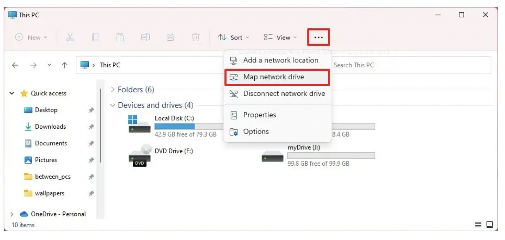
```
    4. Use the `Drive` drop-down menu and choose a letter to assign the drive.
    5. In the `Folder` field, enter the network path to the shared folder, `\\CCBNAS.dyn.ucr.edu\pdo`. (Or click the Browse button to browse the folder to map as a network drive, and click the OK button.)
```{r naspath, echo = F, auto_pdf = TRUE, fig.align = 'left', fig.height = 3}

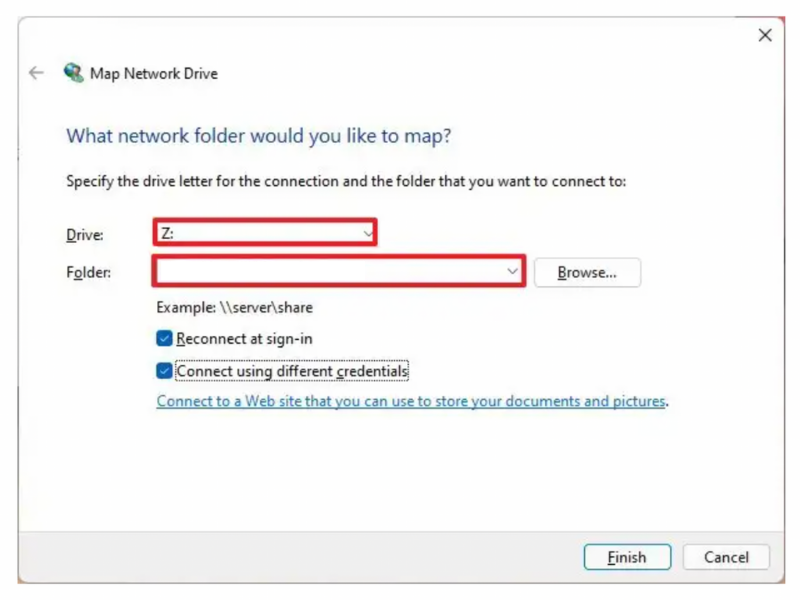
```
    6. Check the `Reconnect at sign-in` option to make the connection permanent.
    7. Check the Connect using different credentials option if the credentials are different from the account you are already using.
    8. Click the Finish button.
    9. Confirm the network account credentials (if applicable) to map the network drive to Windows 11.
    10. Click the OK button.
    
Once you complete the steps, the network drive will become available in File Explorer.

If you run into issues, first read over this [blog post for a common linkage issue](https://www.robertwent.com/blog/mapping-a-synology-nas-drive-in-windows-11/).
    
  
  - For PCs running Windows 10: 
    1. On your Windows 10 PC, open Windows Explorer.
    2. Click on This Computer.
    3. Click on Map network drive.
```{r nasmap10, echo = F, auto_pdf = TRUE, fig.align = 'left', fig.height = 3}

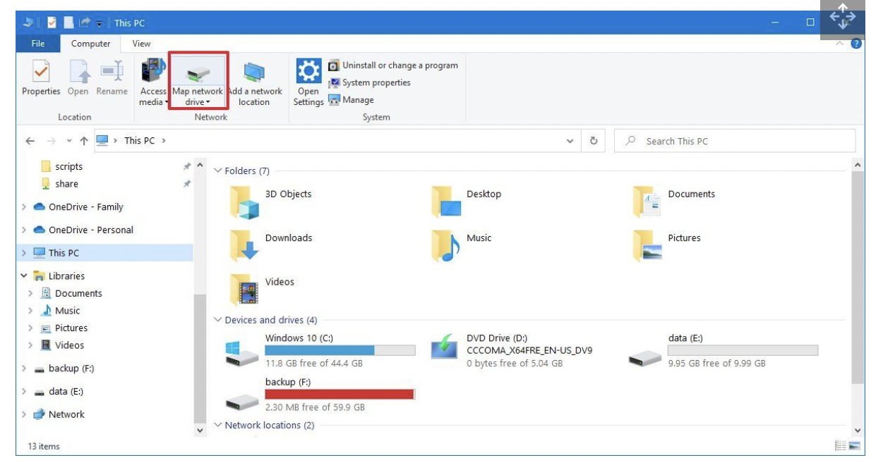
```
    4. Select a drive letter from the drop-down menu.
    5. Enter  `\\CCBNAS.dyn.ucr.edu\pdo` into the folder field.
    6. Click Finish.
    7. Enter your Synology NAS username and password in the Windows credentials pop-up prompt.
    
The mapped network drive will now appear within Windows Explorer as local storage, allowing you to quickly transfer files.
  
  - For Macs: 
    1. Open the Finder app.
    2. Click `Go` on top bar and select `Connect to Server`.
    3. Type in the CCB NAS IP: `smb://CCBNAS.dyn.ucr.edu/pdo`
    4. Enter `User Name` and `Passcode`.
    
There should be a connection set to the CCB NAS at the folder level.

```{r nasmac, echo = F, auto_pdf = TRUE, fig.align = 'left', fig.height = 3}

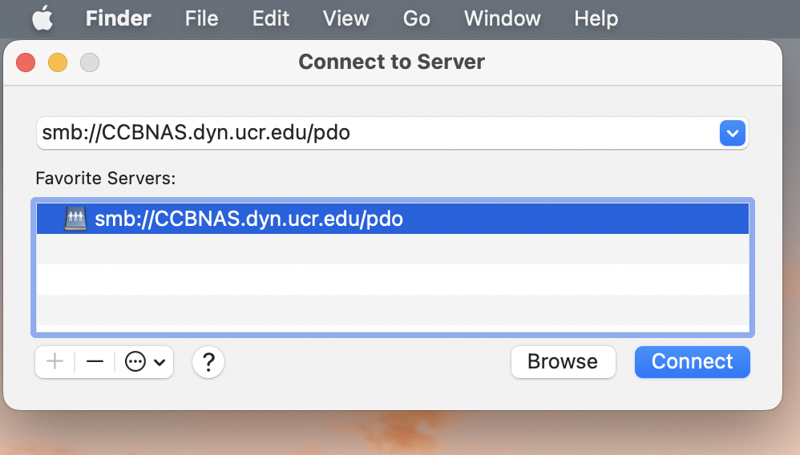
```


## Google Apps

The CCB team utilizes a number of Google applications for project management, data & file sharing, and communicating with colleagues. 

**Google Calendar:** There is a lab Google calendar, *UCR CCB Palm Desert*. This calendar maintains lab mates work and leave schedules as well as any team meetings. Please make sure this calendar is shared with you once you have obtained your UCR NetId. 

**Google Drive:** CCB utilizes *Shared Drive* folders as a file sharing application. You must request access to the shared drive folder from the lab P.I. 

**Google Sites:** There is a [CCB Google Site](https://sites.google.com/ucr.edu/ccbucr/home) that is in draft form at the moment. This site may serve as an intranet or provide public facing information in the future. 

## Microsoft 360 Suite

UCR provides free access to Microsoft Office 365 Pro Plus for faculty, staff, and students! Please note that the available applications differ between PC and Mac OS. To learn more about downloading Microsoft applications, please visit the 
[UC Riverside Microsoft 360 information page](https://ucrsupport.service-now.com/ucr_portal/?id=kb_article&sys_id=0868da980f602f0086b7c7dce1050ee0). 

Microsoft 360 training resources can be found [here](https://support.microsoft.com/en-us/training).

## Slack

```{r slack, echo = F, auto_pdf = TRUE, fig.align = 'left', fig.height = 0.5, fig.alt="Image of Slack logo, light blue, bright green, red, and mustard yellow symbol with lower case slack spelled out in black font."}


```

Slack is a messaging app that connects teams via channels and direct messages (DMs). To make the most of this team communication tool, you will need to download the application to your desktop, have the application open throughout the workday, and adjust the notification settings to your preferences to receive timely alerts.

### Download the Slack app

- For Windows: download Slack [here](https://slack.com/downloads/windows).
- For Macs: download Slack [here](https://slack.com/downloads/mac).
- Consider adding the app to your Android or iOS device(s) for mobile communication with the CCB team! 

### Join the CCB_UCR Slack Workspace

Follow [this link](https://join.slack.com/t/ccbucr/shared_invite/zt-1dfpaguqs-F4CAPCI4ILMvT0JOcSpnag) to join the CCB Slack workspace. Once you have joined, you will be automatically be added to several workspace channels: 

- `#general`: a channel for general announcements and team-wide conversations
- `#how_to_slack`: a channel for tips for how to best use Slack and its apps, as well as a space for the team to ask questions re: how to best utilize this communication tool. Check out the `pinned` messages and `bookmarked` websites.
- `#meetings`: a channel for announcing meetings and sharing resources for team meetings.
- `#random`: a channel to share random news, updates, ideas, jokes, etc.

### Slack Resources 

The [Slack help center](https://slack.com/help/articles/360059928654-How-to-use-Slack--your-quick-start-guide) has useful *how to* guides and [tutorials](https://slack.com/help/articles/360059976673-Slack-video-tutorials) to facilitate working in Slack. 

**Slack Trainings**

Check out Slack's [**Top 5 tips for getting started in Slack**](https://slack.com/intl/en-in/resources/using-slack/top-5-tips-for-getting-started-in-slack) (5 min read) to learn the app's basic functions and communication workflows. 

The [Slack help center's "how to" guide](https://slack.com/help/articles/360059928654-How-to-use-Slack--your-quick-start-guide) has several sections:

- [Quick Reference Guide](https://slack.com/help/articles/360059928654-How-to-use-Slack--your-quick-start-guide#sidebar) (20 min read)
- [Using Slack](https://slack.com/help/categories/200111606): recommended Sections to review
  - Format & style messages (5 min read)
  - Message features & tools (15 min read)
  - Audio & video (10 min read)
- [Your Profile](https://slack.com/help/categories/360000047906)
  - Adjust your notifications: [configure your notifications](https://slack.com/help/articles/201355156-Configure-your-Slack-notifications) (5 min read)
  - Change your settings & preferences: 
    - [set your Slack status & availability](https://slack.com/help/articles/201864558-Set-your-Slack-status-and-availability) (3 min read)
    - [adjust your sidebar preferences](https://slack.com/help/articles/212596808-Adjust-your-sidebar-preferences) (3 min read)
- Connect Tools
  - Connect tools from the Slack app directory: [add apps to your Slack workspace](https://slack.com/help/articles/202035138-Add-apps-to-your-Slack-workspace) (3 min read)
- [Tutorials](https://slack.com/help/categories/360000049063) - a long list of tutorials to review as needed and as time allows


**Slack Apps**

Up to 10 Slack apps are available for free Slack accounts, and unlimited apps are available for Pro Slack accounts.

- A **Trello app** is incorporated in the CCB_UCR Slack workspace. You can create cards in Slack for the CCB Team Projects Trello workspace. To learn how, [follow this Slack connect tool](https://slack.com/help/articles/231967387-Trello-for-Slack).
- The **Zoom app** can be added to Slack that allows your to start or join a Zoom Meeting or Zoom Phone call by using the **“/zoom”** slash command in any Slack channel or message.
- Add the **Google Drive app** to Slack to share resources from the CCB Shared Drive. 
- There is an app for **Microsoft Teams** which allows a Teams video call from Slack. 
  - Start a Teams video call right from Slack
Launch a call in Slack with the /teams-calls slash command. Before joining, get a quick glance at who’s already on the call and when the call kicked off.
  - Jump from Slack straight into a meeting — join Teams meetings directly from calendar reminders in Slack, using the Outlook or Google Calendar apps.
  - Customize call settings for your team. Set Microsoft Teams Calls as your default calling provider, so anyone can start a video call in Teams with a quick click of the phone button in Slack.

**Other cool Slack workspaces to join:**

- [EcoDataScience](https://eco-data-science.github.io/) - an environmental data science study group that started at UC Santa Barbara, but now has an international following!

- [R4DS Online Learning Community](https://www.rfordatasci.com)

- [Society for Open, Reliable, and Transparent Ecology and Evolutionary Biology (SORTEE)](https://www.sortee.org)

## Trello

```{r trello, echo = F, auto_pdf = TRUE, fig.align = 'left', fig.height = 3, fig.alt="Image of Trello logo, blue 3 bold blue lines and trello in black font."}


```

[Trello](https://trello.com/en) is a project management app tool that provides teams the opportunity to create task lists, reference & resource lists, and communicate via tagging! To connect with CCB's Trello Workspace, send a request to CCB's PI. The main board is **CCB Team Projects**.

## Zoom

Zoom is a great tool to schedule virtual meetings, and the CCB hosts Zoom-based team meeting regularly. UC Riverside provides all faculty, staff, and students a free premium account. In order to utilize this service, download the application and sign in via Single Sign-ON (SS0). For the most current installation and log in information, visit UC Riverside's [Information Technology Systems Zoom account page](https://its.ucr.edu/blog/2019/12/17/changes-ucr-zoom-account-access).

- **Step 1**: Download the Zoom application via [UC Riverside's Zoom service page](https://ucr.zoom.us/) - just select the **Download** button!

```{r zoomdownload, echo = F, auto_pdf = TRUE, fig.align = 'center', fig.height = 2, fig.alt="Image of UC Riverside's Zoom Service page that has 4 buttons that prompts users to either Sign In, Sign In, Download, Join, Host."}

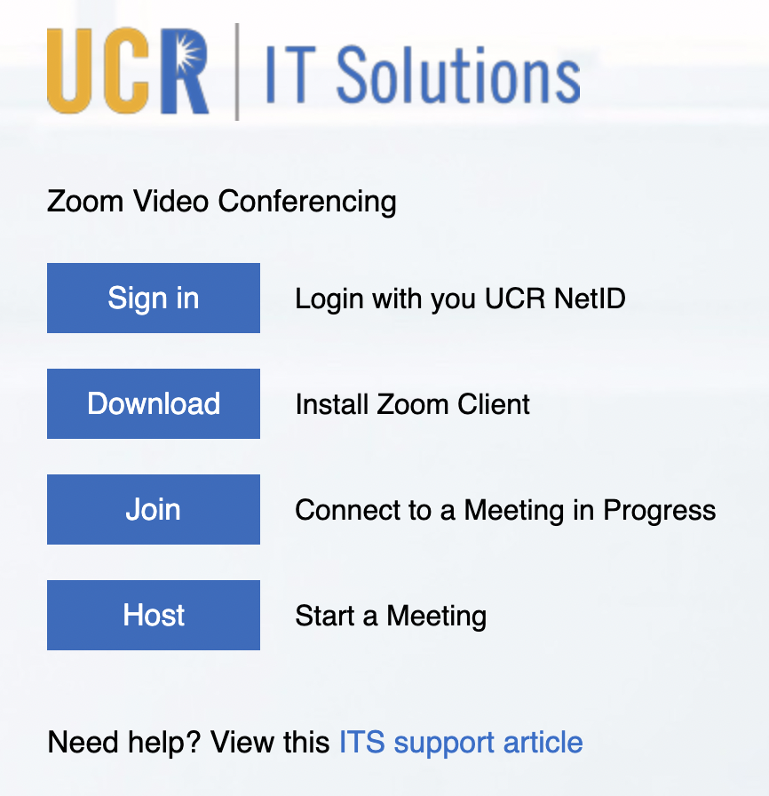
```


- **Step 2**: Once the application is downloading, Zoom will automatically open. You will be prompted to either *Join a Meeting* or *Sign In*. Select *Sign In* and set up your UCR Zoom account using your NetId information. 

- **Step 3**: Click the *Sign In with SSO* button, then enter `ucr` in the *company domain* section. 

```{r sso, echo = F, auto_pdf = TRUE, fig.align = 'center', fig.height = 2, fig.alt="Image of Zoom Account Sign In prompt displaying 4 buttons: SSO, Apple, Google, Facebook"}

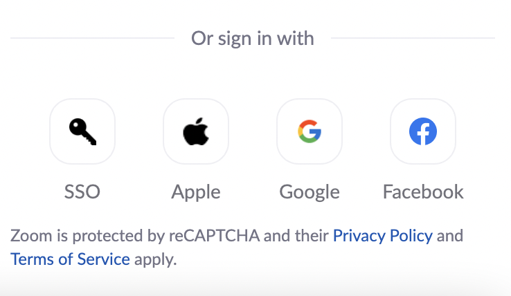
```

```{r domain, echo = F, auto_pdf = TRUE, fig.align = 'center', fig.height = 2}

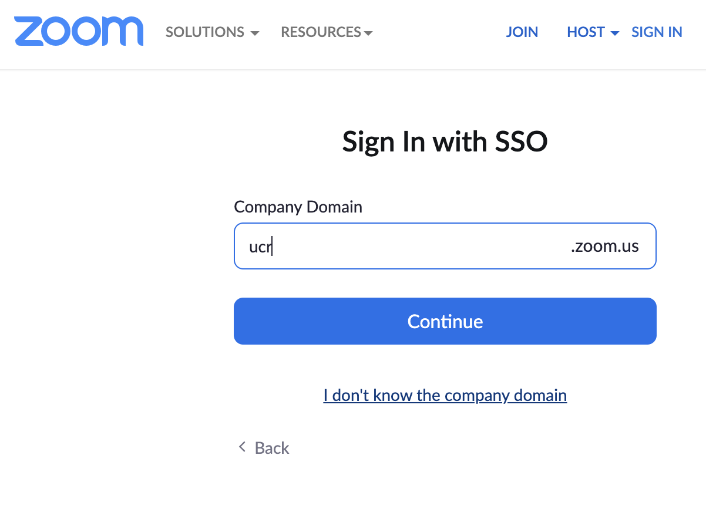
```

- **Step 4**: You will then be prompted to sign in, this time using your UCR NetId. The program may open up an authentication window requesting your UCR NetId as shown below:

```{r zoomcred, echo = F, auto_pdf = TRUE, fig.align = 'center', fig.height = 2}

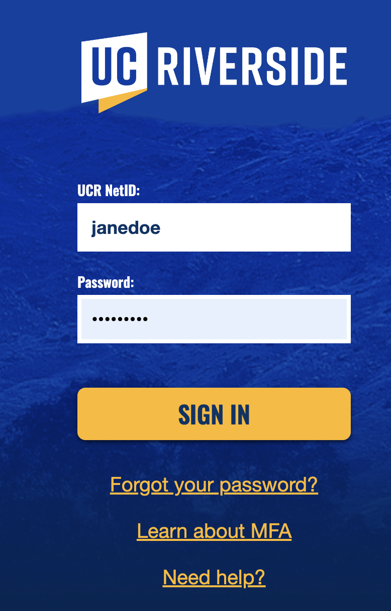
```

- **Step 5**: Personalize your Zoom account! You can add your name, pronouns, and an image to your profile, create a *personal Zoom room* to utilize as a default meeting space, and set settings like *mute all participants when they join a meeting* or turn off settings such as *start meetings with participant video on. Participants can change this during the meeting.*

Happy Zooming! 

**Zoom Resources:**

- [Zoom Help Desk](https://support.zoom.us/hc/en-us)
- [Zoom meetings trainings](https://livetraining.zoom.us/rec/play/6Zx8f-j7qDw3GNeQswSDAPJ-W9S4J6qshiYfqfcNyk20WyIHNFChb7pHZuClKrDVR76R1BxgtMF4txaS?continueMode=true)
- [UC Riverside Zoom Services](https://ucr.zoom.us/)

## Zotero

The Center for Conservation Biology shares research references through Zotero software. Zotero is a citation management tool and allows groups to collect and share references easily. The Zotero browser extension makes it easy to copy citations from webpages. 

To install Zotero and the extension, please follow UC Riverside's installation instructions [here](https://guides.lib.ucr.edu/c.php?g=171064). *Note*: These instructions are for a **Windows** machine, but it is a similar process for Macs. 

```{r zotero, echo = F, auto_pdf = TRUE, fig.align = 'center', fig.height = 6}

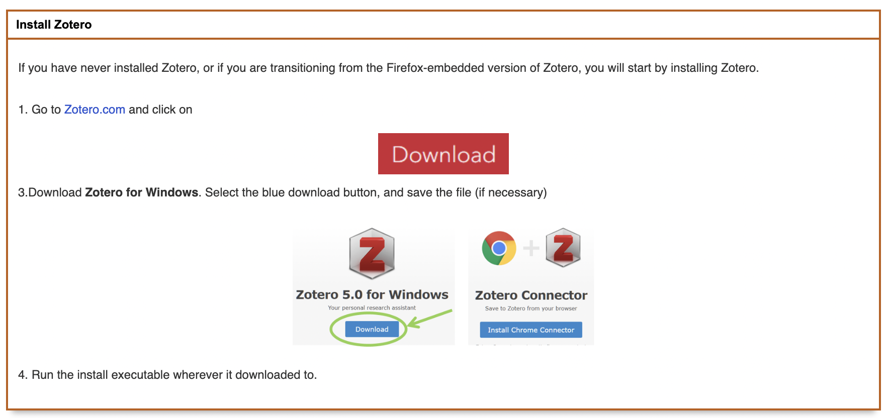
```


```{r zoteroextension, echo = F, auto_pdf = TRUE, fig.align = 'center', fig.height = 6}

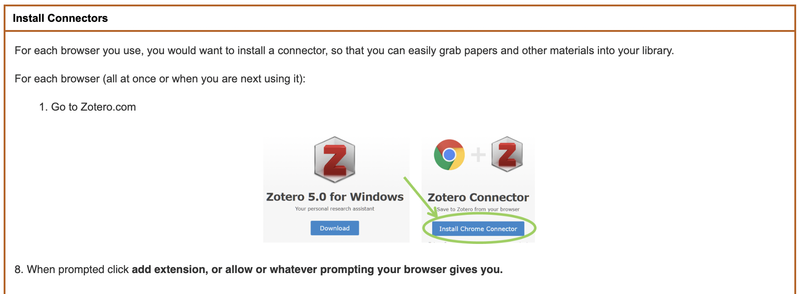
```

The next step is to create a Zotero account and enable syncing to enable extension use and to be able to join the [CCB Zotero Reference Group](https://www.zotero.org/groups/4734848/ccbucr). Make sure to use your using the UCR email address when setting up the Zotero account. 

```{r zoterosyncing, echo = F, auto_pdf = TRUE, fig.align = 'center', fig.height = 6}

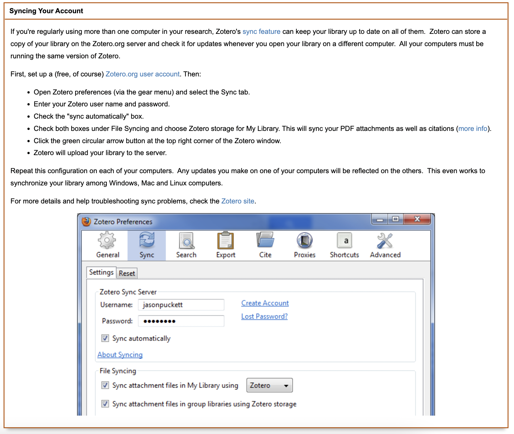
```

To connect to the CCB Zotero Reference Group, navigate to [this link](https://www.zotero.org/groups/4734848/ccbucr). If you do not have access to the Group page, please send a request that you be added to the CCB PI.

For more information on how to use Zotero, check out these links:

- [UC Riverside Zotero Tips & Tricks](https://guides.lib.ucr.edu/c.php?g=171064&p=1126842)
- [Zotero Quick Start Guide](https://www.zotero.org/support/quick_start_guide)
- [Zotero Groups](https://www.zotero.org/support/groups)
- [RStudio Citations](https://www.youtube.com/watch?v=zuuOYjE8m98) - add BibTex citation format in Zotero then quickly use .bib files in R to create references in markdown. 