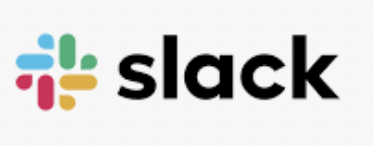

# Project Management Tools {#projmgmt}

## Trello

```{r trello, echo = F, auto_pdf = TRUE, fig.align = 'left', fig.height = 3, fig.alt="Image of Trello logo, blue 3 bold blue lines and trello in black font."}


```

[Trello](https://trello.com/en) is a project management app tool that provides teams the opportunity to create task lists, reference & resource lists, and communicate via tagging! Ask the 


## Slack

```{r slack, echo = F, auto_pdf = TRUE, fig.align = 'left', fig.height = 0.5, fig.alt="Image of Slack logo, light blue, bright green, red, and mustard yellow symbol with lower case slack spelled out in black font."}


```

Slack is a messaging app that connects teams via channels and direct messages (DMs). 
To join the CCB Slack workspace, follow [this link](https://join.slack.com/t/ccbucr/shared_invite/zt-1dfpaguqs-F4CAPCI4ILMvT0JOcSpnag). 

There is a Trello app incorporated in the CCB UCR slack workspace. You can create cards in Slack for the CCB Team Projects Trello workspace. To learn how, [follow this Slack connect tool](https://slack.com/help/articles/231967387-Trello-for-Slack).

Other cool Slack workspaces to join:

- [EcoDataScience](https://eco-data-science.github.io/) - an environmental data science study group that started at UC Santa Barbara, but now has an international following!

- [R4DS Online Learning Community](https://www.rfordatasci.com)

- [Society for Open, Reliable, and Transparent Ecology and Evolutionary Biology (SORTEE)](https://www.sortee.org)

## Google Apps

The CCB team utilizes a number of Google applications for project management, data & file sharing, and communicating with colleagues. 

**Google Calendar:** There is a lab Google calendar, *UCR CCB Palm Desert*. This calendar maintains lab mates work and leave schedules as well as any team meetings. Please make sure this calendar is shared with you once you have obtained your UCR NetId. 

**Google Drive:** CCB utilizes *Shared Drive* folders as a file sharing application. You must request access to the shared drive folder from the lab P.I. 

**Google Sites:** TBD
