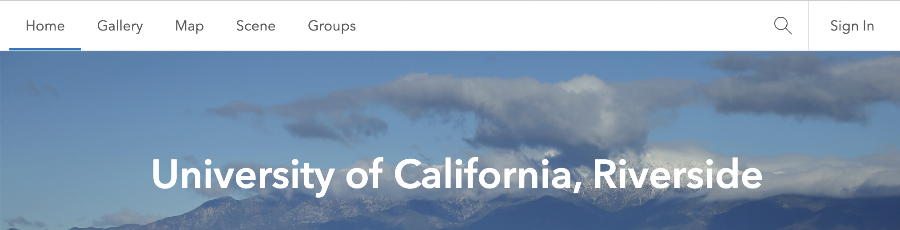
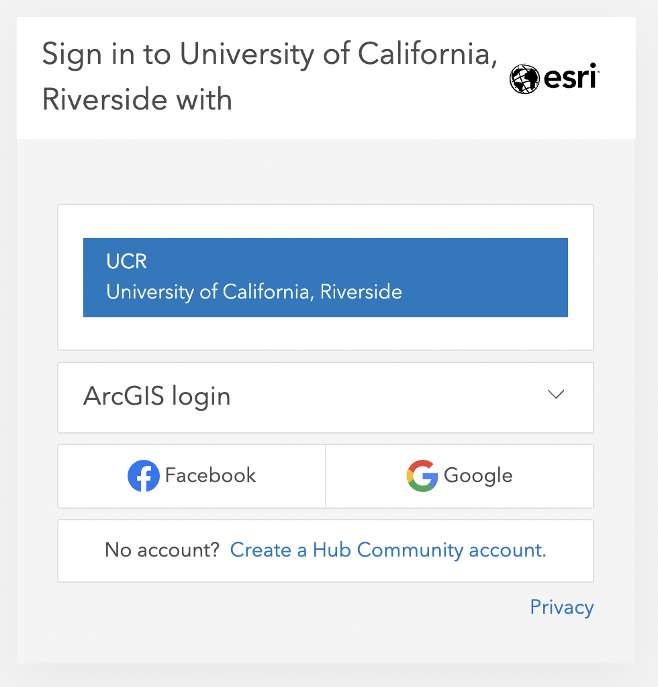
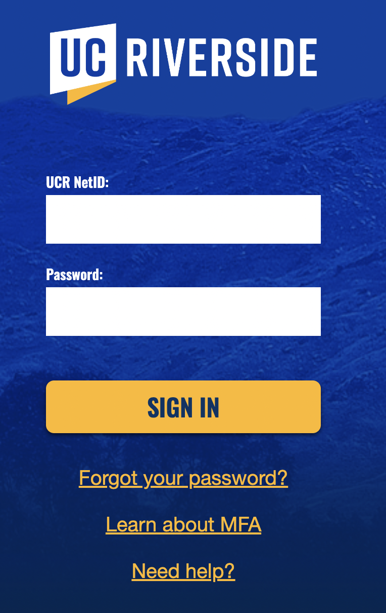
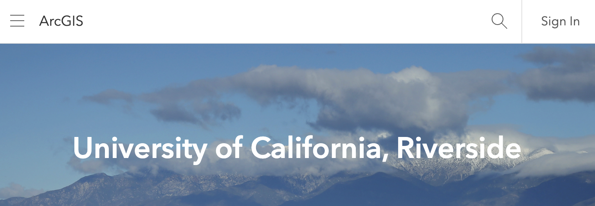
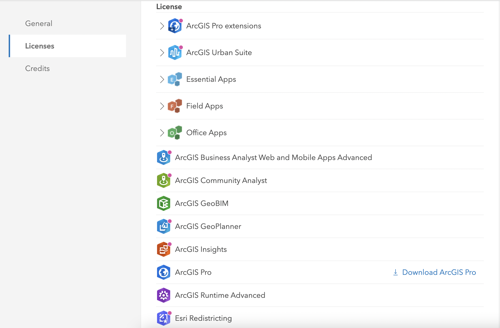

# ESRI GIS Platform {#esri}

## ESRI ArcGIS

UC Riverside provides free access to ESRI ArcGIS software and platforms for faculty, staff, and students. Learn more about these data analysis and visualization tools [here](https://ucrsupport.service-now.com/ucr_portal?id=sc_category&sys_id=e9b36a7e1b691c10eab58734ec4bcb78&catalog_id=-1).

**ESRI Platform Software**

- **ESRI ArcGIS Desktop**: a proprietary desktop GIS software suite that allows you to create maps, perform spatial analysis and manage data. Required software for installation: Microsoft .NET (aka a PC machine), Python 2.7+. 
- **ESRI ArcGIS Pro**: ArcGIS Desktop is transitioning to ArcGIS Pro, an interactive spatial data visualization tool that allows users to create 2D maps, 3D scenes, and share projects on ArcGIS Online. Training resources for ArcGIS Pro are [here](https://www.esri.com/en-us/arcgis/products/arcgis-pro/resources).
- **ESRI ArcGIS Online**: This is cloud-based software that runs on any device with an internet connection. It allows users to easily publish maps on-line, access other UCR spatial products, and create spatial data dashboards and hubs. Check out [UCR ArcGIS Online](https://ucr.maps.arcgis.com/home/index.html).


## Install ESRI ArcGIS software

For additional installation information, navigate to [UCR's ServiceLink Access ArcGIS Online and ArcGIS Pro help page](https://ucrsupport.service-now.com/ucr_portal?id=kb_article&sys_id=0231b6e21b095190453e7592cd4bcbaf).

### ESRI ArcGIS Online

Instructions for how to sign in to ArcGIS Online via UCR.

- **Step 1:** Navigate to the [UCR's Academic ArcGIS Online site](https://ucr.maps.arcgis.com/home/index.html).

- **Step 2:** Click on the ‘Sign In’ link at the top right hand corner of the landing page.

```{r arcgisonline, echo = F, auto_pdf = TRUE, fig.align = 'center', out.width= "75%", fig.alt="Screen shot of UCR ArcGIS Online sign in page."}


```

- **Step 3:** Select the **UCR University of California, Riverside Enterprise login** (blue button) option. 

```{r ucrenterprise, echo = F, auto_pdf = TRUE, fig.align = 'center', out.width= "60%", fig.alt="Screen shot of UCR ArcGIS Online Enterprise Account sign in page."}


```


- **Step 4:** Sign in with UCR Net ID and Password

```{r ucrid, echo = F, auto_pdf = TRUE, fig.align = 'center', out.width= "55%", fig.alt="Screen shot of UCR Net ID and Password sign in prompt."}


```

### ESRI ArcGIS Pro

Instructions for how to download ArcGIS Pro from UCR's ArcGIS Online.

- **Step 1:**  Navigate to the UCR's Academic Instance of [ArcGIS Online](https://ucr.maps.arcgis.com/home/index.html).

- **Step 2:**  Click on the `Sign In` link at the top right hand corner of the landing page.

```{r esrisignin, echo = F, auto_pdf = TRUE, fig.align = 'center', out.width= "75%", fig.alt="Screen shot of UCR ArcGIS Online sign in page."}


```

- **Step 3:** Select the **UCR University of California, Riverside Enterprise login** (blue button) option under UCR.

- **Step 4:** At the top right of the page, click your user name and click `My Settings`.

- **Step 5:** On the `My Settings` page, click the Licenses tab.

- **Step 6:** Scroll down, next to ArcGIS Pro, click `Download ArcGIS Pro`.

```{r esripro, echo = F, auto_pdf = TRUE, fig.align = 'center', out.width= "75%", fig.alt="Screen shot of UCR ArcGIS Online and Pro account license options and ArcGIS Pro download button."}


```

#### Archived UCR ESRI ArcGIS Desktop and Pro Installation Instructions

This was the installation process prior to 2020. If there are issues with the above instructions, this is an alternative method to access ESRI software. 

- **Step 1:** Navigate to the [UCR Portal ServiceLink Software Catalog](https://ucrsupport.service-now.com/ucr_portal). 

- **Step 2:** Under the Information Technology section, select **Request Services & Software** link.

```{r servicelink, echo = F, auto_pdf = TRUE, fig.align = 'center', out.width= "75%", fig.alt="Screen shot of UCR ServiceLink homepage information technology section."}

knitr::include_graphics("images/ServiceLink.png")
```

- **Step 3:** Scroll down to the **Software Request** card and select link.  

```{r softwarerequest, echo = F, auto_pdf = TRUE, fig.align = 'center', out.width= "45%"}

knitr::include_graphics("images/softwarerequest.png")
```

- **Step 4:** Complete the Software Request form using your UCR NetId and UCR email, then select **Submit**. 

```{r requestsubmit, echo = F, auto_pdf = TRUE, fig.align = 'center', out.width= "75%"}

knitr::include_graphics("images/requestsubmit.png")
```

- **Step 5:** The UC IT team will send email notifications to provide further instructions. 

### ESRI Resources

Here are few resources that provide tutorials and workshops on how to use ESRI software:

- **ESRI Academy**: Search the ESRI Acadmey [Course Catalog](https://www.esri.com/training/) for MOOCs, Tutorials, and Web Courses. 
- **UC ANR IGIS** - the [UC Agriculture and Natural Resources Informatics & GIS Program](https://igis.ucanr.edu/Training/) host ESRI ArcGIS training webinars and virtual workshops throughout the year. 
- **LinkedIn Learning** - Through [UCR LinkedIn Learning](https://www.linkedin.com/learning/topics/arcgis?u=26135898), users may take ESRI ArcGIS courses and learning paths.
