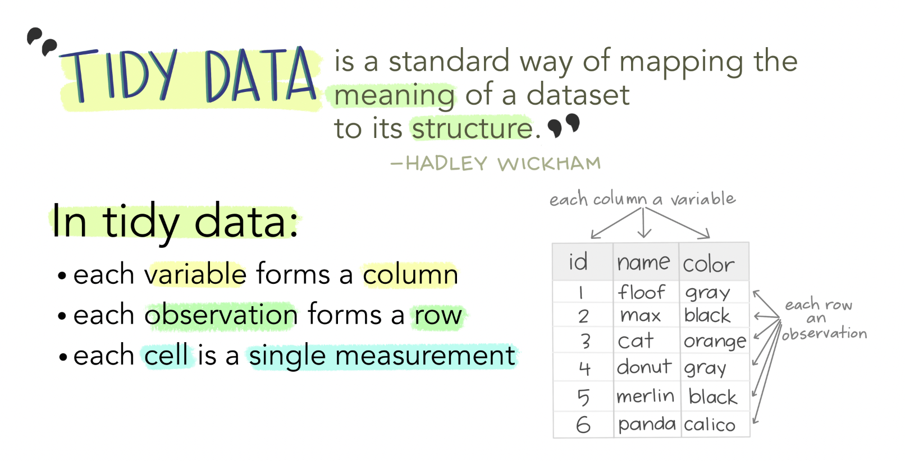
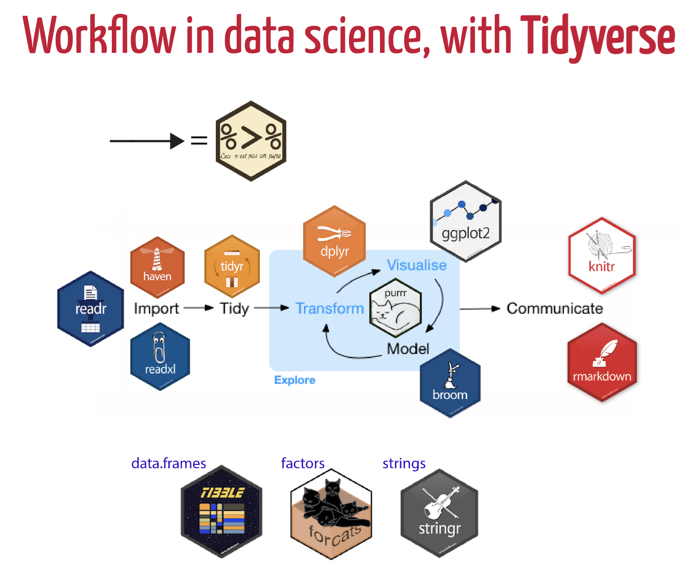

# Directory Organization & Data Project Development {#organization}

## File Naming

When creating file names, best practices dictate that you should:

- Create meaningful but brief names. Limit a file name to 25 characters, if possible;
- Use file names to classify types of files;
  - ex: `20230131_DTLA_RA.csv` file name classifies this file as Rapid Assessment vegetation monitoring data  from the Desert Tortoise Linkage Area and was created on Jan. 31, 2023;
- Avoid using spaces, dots and special characters (ex: & or ? or !);
- Use capital letters to delimit words (aka UpperCamelCase), not spaces or underscores for **data files**.(ex: `20170217CVStormwaterVAP.csv`);

```{r case, echo = F, auto_pdf = TRUE, fig.align = 'center', out.width= "75%", fig.cap= "Types of font cases (L to R, clockwise): Screaming Snake Case, Camel Case, Upper Camel, Snake Case, Kebab Case. Art Credit: Dr. Allison Horst, UCSB"}

knitr::include_graphics("images/case_horst.jpeg")
```

- Use dashes (-) or underscores (_) to separate elements in a file name for **documents** (ex: `20231212_CVMC_CRCA01_Proposal_LCS.doc`);
- Always use the [ISO 8601](https://www.iso.org/iso-8601-date-and-time-format.html) date format in file names: **YYYYMMDD**. For example, in the file name *20230131_DTLA_RA.csv* January 31, 2023 is represented as **20230131**;
- Preserve the 3-letter file extension for application-specific codes of file format (e.g. .doc, .xls, .mov, .tif);
- With sequential numbering (e.g., 1, 2, 3, etc.), use leading zeros to accommodate multi-digit versions. For example, use 01-10 for 1-10, 001-100 for 1-100, and so on;
- Name all files to reflect their content or function. For example, use names such as `tortoise_count_table.csv`, `manuscript.Rmd`, or `vegetation_analysis.r`. Do **not** use general nomenclature with sequential numbers (e.g., `result1.csv`, `result2.csv`) or a location in a final manuscript (e.g., `fig_3_a.png`), since those numbers will almost certainly change as the project evolves;
- Include versioning of file names where appropriate, indicating the version with `rev` the date (ex: CVMC_CRCA01_Proposal_LCS_rev20230131.doc).
  - this is a bit different from the standardized **date first** file naming. It is recommended to **avoid** *starting* the filename with a version number .The CCB lab can set the versioning to `CVMC_CRCA01_Proposal_LCS_rev20230131.doc`, but for the final document, name it `20231212_CVMC_CRCA01_Proposal_LCS.doc`.
  - *Final copies of tabular data* should be stored as a copy without macros or formulas, in a non-proprietary format such as comma or tab separated values (.csv or .txt) [@Smithsonian_2021].

- Order the elements in a file name in the most appropriate way to retrieve the record. For example, 
  - file name with the date first, 
  - the project name or project location (acronyms are very helpful here) should be second, 
  - then the type of data or file (either RA or Report or Brochure),
  - then version and/or author,

### File Name Examples

- Vegetation assessment data collected on February 17, 2017 at the Coachella Valley Stormwater Channel: `20170217_CVStormwaterVAP.csv`, 
- Coachella Valley Mountain Conservancy Climate Resistance & Community Access Grant Program (Proposal No. CRCA-01) proposal document authored by Lynn Sweet and finalized & submitted on December 31, 2022: `20221231_CVMC-CRCA01_Proposal_LCS.doc`
- Journal articles: `2020_Thorne_VegetationRefugiaInformClimate-adaptiveLandManagement.pdf`. 

### ESRI File Naming Guidelines & Unique Exceptions

When naming objects, folders, databases to be used by ESRI software, there are some unique considerations that contradict the above file naming guidelines! 

- **Avoid long pathnames.** 
Try to "flatten" folder structures so that file pathnames under 128 characters. The absolute Windows pathname limit (MAXPATH) is 260 characters. 

- **Start with a letter.** 
*Never* begin an ArcGIS object name (table, field, relationship class, mxd file, folder, etc) with a number or any other non-alpha character. 

- **No reserved words, aka common coding function words.** 
Avoid names that may conflict with SQL or other language's reserved words. For example: `OBJECTID`, `VALUE`, `COUNT`, `NOT`, `OR`, `ON`, `IN`, `OVER`, `SELECT`.  This is to avoid confusing both people and SQL or Python or R.

- **Be brief.** 
All field names should contain **10 characters or less**. This is a dBase limit, so it applies to .dbf files AND shapefiles. For that reason it's best practice in case you need to go "through" a dbf based format. Coverage and grid names have a limit of 13 characters, but 10 is safer. If you really want a longer name around or one with special characters, use the alias.

- **Raster dataset names MUST start with a letter**
Raster names can be particularly problematic and it is best to keep the filename **under 14 characters** to support Esri grid format, and special characters in the path (space, &, -) may cause raster exports and tools to fail with cryptic error messages (like 999999).

- **Use code in scripting to check names.** 
The arcpy methods `ValidateFieldName` and `ValidateTableName` can be used at parameter validation time, or in your code, to prevent users of your tool from inserting invalid output names. The `CreateScratchName` method if provided the proper arguments, will generate valid dataset names.


#### Addtional Resources for Geodatabase File Management

- [The United Nations Office for the Coordination of Humanitarian Affairs](https://sites.google.com/site/ochaimwiki/file-and-dataset-naming-manual/file-naming-convention) has an informative wiki page regarding how they organize and name spatial files. 
   - The OCHA has an inspiring *dummy directory* structure [here](https://sites.google.com/site/ochaimwiki/file-and-dataset-naming-manual/file-structure)
- [Earth Data Analysis Center](https://edac.unm.edu/) created a [helpful file naming and metadata creation presentation](https://slideplayer.com/slide/8981458/). 
- [UCSD GIS & Geospatial Resource list](https://ucsd.libguides.com/gis/data-source)

## Directory Organization

The amount of data and files research organizations create and store has grown significantly due to technological advances in field data collection tools and open-source software. As the amount of data collected and reports generated increases, it is necessary to establish a clear, logical directory organization framework.  

### Recommendations for Directory Organization

The following recommendations were pulled from @Spreckelsen_2020. 

1. **Put each project in its own directory**

Create a new folder for each new project and name that folder after the project. Some researchers create a separate project for each manuscript they are working on, while others group all research on a common theme or data set into a single project.
As a rule of thumb, divide work into projects based on the overlap in data and code files. If 2 research efforts share no data or code, they will probably be easiest to manage independently. If they share more than half of their data and code, they are probably best managed together, while if you are building tools that are used in several projects, the common code should probably be in a project of its own. Projects do often require their own organizational model, but below are general recommendations on how you can structure data, code, analysis outputs, and other files. The important concept is that it is useful to organize the project by the types of files and that consistency helps you effectively find and use things later.

2. **Put text documents associated with the project in a 'document' directory.** 

This includes files for manuscripts, documentation for source code, and/or an electronic lab notebook recording your experiments. Subdirectories may be created for these different classes of files in large projects. Create subdirectories within the `document` folder to account for the various types of documents required for each project. For example, does this project include pre-proposals for funding? If so, create a subfolder `proposal`. If the project is grant funded, create a `report` folder to save the various reports required for the funding. 

3. **Raw Data and Analysis Results**
  - **Put raw data and metadata in a `data` directory** 

The data directory might require subdirectories to organize raw data based on time, method of collection, or other metadata most relevant to your analysis. These files should include the raw .xls and .csv files, plus additional .txt & .md files.

  - **Put files generated during cleanup and analysis in a `results` directory**

The `results` directory will usually require additional subdirectories for all but the simplest projects. *Generated files* are considered intermediate files, such as cleaned data, statistical tables, and final publication-ready figures or tables and should be separated clearly by file-naming conventions or placed into different subdirectorie. 

4. **Put project source code in the `repository` directory.** 

The `respository`, also contains all of the code written for the project. This includes programs written in interpreted languages such as R or Python; as well as shell scripts, snippets of SQL used to pull information from databases; and other code needed to regenerate the results.
This directory may contain **two** conceptually distinct types of files that should be distinguished either by clear file names or by additional subdirectories.

  - The first type is files or groups of files that perform the core analysis of the research, such as data cleaning or statistical analyses. These files can be thought of as the "scientific guts" of the project.
  - The second type of file in `respository` is controller or driver scripts that contain all the analysis steps for the entire project from start to finish, with particular parameters and data input/output commands. A controller script for a simple project, for example, may read a raw data table, import and apply several cleanup and analysis functions from the other files in this directory, and create and save a numeric result. For a small project with 1 main output and all the code is in R, save R files in a `R` folder. 
  
5. **Images and Visualizations**

Photos, screenshots, and plots or other types of data visualizations should be saved in a separate `images` project sub-directory. 
  
6. **Put project scratch work and analysis in a `sandbox` directory.** 

Create a `sandbox` directory within the appropriate project folder for experimental project work. A `sandbox` folder is useful in a the `src` or `r` folder as it can serve as location to save test code or tutorials to conduct analysis.

7. **Create an `archive` folder for out-of-date data or versions**

An `archive` folder serves as a repository for long-term data retention. Data and reference materials stored in the `archive` folder are no longer the most relevant versions, but important reference files that should be preserved but not utilized for analysis. 

### Folder Organization Examples:

1) Data Analysis Project 

**Simple Project**
```
my-simple-project/
├── InputData          <- Folder containing data that will be processed
├── OutputData         <- Folder containing data that has been processed
├── Figures            <- Folder containing with figures or tables summarizing the results
├── Code               <- Folder the scripts or programs to do the analysis
├── LICENSE            <- File explaining the terms under which data/code is being made available
├── README.txt         <- File documenting the analysis, and (ideally) the purpose of each file.
```

**Advanced Projects**

Many kinds of input data, documentation, and code.

```
my-advanced-project/
├── repository/
├── AUTHORS.md         <- File: List of people that contributed to the project (Markdown format)
├── LICENSE            <- File: Plain text file explaining the usage terms/license of the data/code file (CC-By, MIT, GNU, etc.)
├── README.md          <- File: Readme file (Markdown format)
├── bin                <- Folder: Your compiled model code can be stored here (not tracked by git)
├── config             <- Folder: Configuration files, e.g., for doxygen or for your model if needed
├── data               <- Folder: Data for this project
│   ├── external       <- Folder: Data from third party sources.
│   ├── interim        <- Folder: Intermediate data that has been transformed.
│   ├── processed      <- Folder: The final, canonical data sets for modeling.
│   └── raw            <- Folder: The original, immutable data dump.
├── docs               <- Folder: Documentation, e.g., doxygen or scientific papers (not tracked by git)
├── notebooks          <- Folder: Ipython or R notebooks
├── reports            <- Folder: Manuscript source, e.g., LaTeX, Markdown, etc., or any project reports
│   └── figures        <- Folder: Figures for the manuscript or reports
└── src                <- Folder: Source code for this project
    ├── R           <- Folder: scripts and programs to process data
    ├── external       <- Folder: Any external source code, e.g., other projects, or external libraries
    ├── models         <- Folder: Source code for your own model
    ├── tools          <- Folder: Any helper scripts go here
    └── visualization  <- Folder: Visualisation scripts, e.g., matplotlib, ggplot2 related
```

```
my-advanced-project_002/
├── repository/
│   ├── images/
│   │   ├── image-01.jpg
│   │   └── image-02.jpg
│   ├── templates/
│   │   ├── page.html
│   │   └── post.html
│   └── index.html
|   |── r/
│   |   ├── function.r
|   |   ├── analysis.r
|   |   ├── report.Rmd
│   ├── data/
│   |   ├── function.r
│   |   ├── function.r
│   ├── myproject.Rproj
└── README.md
```


2) Vegetation Monitoring Project 

```
vegetation/
DesertTortoiseLinkageArea/
├── images/
│   ├── RelevePlots
│   │   ├── DTLA_plot001-01.jpg
│   │   └── DTLA_plot001-02.jpg
│   ├── PlantId
│   │   ├── AlloniaIncarnata_BerdooCyn_2022-001.jpg
│   │   └── AlloniaIncarnata_BerdooCyn_2022-002.jpg
├── repositories/
│   ├── DTLA
│   │   │── r/
│   │   │   ├── function.r
│   │   │   ├── analysis.r
│   │   │   ├── report.Rmd
│   │   ├── data/
│   │   │   ├── processeddataplot001.csv
│   │   │   ├── processeddataplot002.csv
│   │   │   ├── rawdata/
│   │   │   │   ├── rawdataplot001.csv
│   │   │   │   ├── rawdataplot002.csv
│   │   ├── myproject.Rproj
│   │   ├── README.md
├── documents/
│   ├── DTLA
│   │   │── _archive/
│   │   │   │── geodatabase/
│   │   │   │── report_drafts/
│   │   │── reports/
│   │   │   ├── 2021AnnualReport.doc
│   │   │   ├── 2021AnnualReport.doc
│   │   │   ├── 2021AnnualReport.doc
│   │── reference/
│   │   │── CNPS_RapidAssessmentProtocol/
│   │   │   ├── 2017_CNPSRapidAssessmentProtocol.pdf
│   │   │   ├── 2018_CNPSRapidAssessmentProtocol.pdf
│   │   │   ├── 2020_CNPSRapidAssessmentProtocol.pdf
│   │   │── Species/
│   │   │   ├── PlantIdentificationGuides
│   │   │   │   ├── 2022_JOTRSpeciesGuide.pdf
│   │   │   ├── SpeciesInformation
│   │   │   │   ├── AlloniaIncarnata
│   │   │   │   │   ├── AlloniaIncarnataSpeciesInfo.pdf
└── recycle/

```

### Additional Resources

- [Gentzkow M, Shapiro JM. Code and Data for the Social Sciences: A Practitioner's Guide; 2014](https://web.stanford.edu/~gentzkow/research/CodeAndData.pdf). https://web.stanford.edu/~gentzkow/research/CodeAndData.pdf.
- [Hampton S.E, et al.  Skills and Knowledge for Data-Intensive Environmental Research. BioScience, Volume 67, Issue 6, June 2017, Pages 546–557.](https://academic.oup.com/bioscience/article/67/6/546/3784601)
- [Noble WS. A Quick Guide to Organizing Computational Biology Projects. PLoS Comput Biol. 2009;5(7).](https://journals.plos.org/ploscompbiol/article?id=10.1371/journal.pcbi.1000424)


## Data Management

@Wilson_2017 recommend following these data management practices:

- Save the raw data.
- Ensure that raw data are backed up in more than one location.
- Create the data you wish to see in the world.
- Create analysis-friendly data.
- Record all the steps used to process data.
- Anticipate the need to use multiple tables, and use a unique identifier for every record.
- Submit data to a reputable DOI-issuing repository so that others can access and cite it (ex: [DataOne](https://www.dataone.org/), [KNB](https://knb.ecoinformatics.org/), and [NCEI](https://www.ncei.noaa.gov/access/search/index).


### Tidy Data

**Tidy data** is one of the most important concepts for any data scientist. It provides predictable organization for data that makes coding, analysis, and collaboration easier. 

Tidy data satisfies the following conditions:

- Each observation is in a row
- Each variable in a column
- Each value is in a single cell

```{r tidydata, echo = F, auto_pdf = TRUE, fig.align = 'center', out.width= "90%", fig.cap= "Tidy data allows for efficient data science, easy collaboration, and ensures reproducibility and reuse. Art Credit: Dr. Allison Horst, UCSB"}


```

@Broman_2018 state the core principles for tidy data are:

- be consistent with data collection and entry, 
- write dates like YYYY-MM-DD, 
- don't leave any cells empty, 
- put just one thing in a cell, 
- organize the data as a single rectangle
  - with subjects as rows and variables as columns, 
  - and with a single header row, 
- create a data dictionary, 
- don't include calculations in the raw data files, 
- don't use font color or highlighting as data, 
- choose good names for things, 
- make backups, 
- use data validation to avoid data entry errors, 
- and save the data in **plain text files** (i.e. .csv, .txt).

The R package, `tidyverse`, is one of the best tools to tidy data! The tidyverse is an opinionated collection of R packages designed for data science. All packages share an underlying design philosophy, grammar, and data structures.

Install the complete tidyverse with:

```{r, eval=FALSE, echo=TRUE}
install.packages("tidyverse")
```

Then load the **tidyverse** package in a code chunk with the command:

```{r, eval=FALSE, echo=TRUE}
library(tidyverse)
```

The packages contained within the [**tidyverse**](https://www.tidyverse.org/packages/) are: 

- [ggplot2](https://ggplot2.tidyverse.org/) is a system for creating graphics for your data, based on The Grammar of Graphics. Plot your data with ggplot2!
- [dplyr](https://dplyr.tidyverse.org/) is a data manipulation package that provides a consistent set of verbs to manipilate data:
  - `mutate()` adds new variables that are functions of existing variables
  - `select()` picks variables based on their names.
  - `filter()` picks cases based on their values.
  - `summarise()` reduces multiple values down to a single summary.
  - `arrange()` changes the ordering of the rows.
- [tidyr](https://tidyr.tidyverse.org/) is the tidying data workhorse package within the **tidyverse**. Use **tidyr** to wrangle, pivot, and convert or replace missing data.
- [readr](https://readr.tidyverse.org/) is a fast way to read rectangular data from delimited files, such as comma-separated values (CSV) and tab-separated values (TSV). 
- [purrr](https://purrr.tidyverse.org/) provides a complete and consistent set of tools for working with functions and vectors.
- [tibble](https://tibble.tidyverse.org/) is a version of `data.frame`, but they  do less (i.e. they don’t change variable names or types, and don’t do partial matching) and complain more (e.g. when a variable does not exist). 
- [stringr](https://stringr.tidyverse.org/) provides a cohesive set of functions designed to make working with strings as easy as possible. 
- [forcats](https://forcats.tidyverse.org/) provides a suite of tools that solve common problems with factors, including changing the order of levels or the values.
  - `fct_reorder()`: Reordering a factor by another variable.
  - `fct_infreq()`: Reordering a factor by the frequency of values.
  - `fct_relevel()`: Changing the order of a factor by hand.
  - `fct_lump()`: Collapsing the least/most frequent values of a factor into “other”. 

```{r tidyverse, echo = F, auto_pdf = TRUE, fig.align = 'center', out.width= "100%", fig.cap= "Data Science workflow utilizing Tidyverse packages. Art Credit: Dr. Olivier Gimenez"}


```

### Project Development and Collaboration

The foundation of developing and organizing a project is to design it to make it easy for new collaborators to join and for current coworkers to collaborate seemlessly. This involves making it easy for people to set up a local workspace so that they can contribute, help them find what to contribute, and make the organization process clear so that they know how to contribute.

Steps to consider when developing a research project:

1. **Create an overview of your project.**

Have a short file in the project's home directory that explains the purpose of the project. This file (generally README.txt or README.md) should contain the project's:

- title, 
- a brief description, 
- up-to-date contact and/or author information, 
- and an example or 2 of how to run various cleaning or analysis tasks,
- describes what is needed for the project and use or contribute to it, i.e., dependencies that need to be installed, tests that can be run to ensure that software has been installed correctly, and guidelines or checklists that the project adheres to.

It is often the first thing users and collaborators on your project will look at, so make it explicit how you want people to engage with the project. 

2. **Create a shared "to-do" list.** 

This can be a plain text file called something like notes.txt or todo.txt, or utilize GitHub project management tools to create a new issue for each to-do item. Describe the items clearly so that the tasks are clear and easily understood.

3. **Decide on communication strategies.** 

Make explicit decisions about (and publish where appropriate) how members of the project will communicate with each other and with externals users/collaborators. This includes the location and technology for email lists, chat channels, voice/video conferencing, documentation, and meeting notes, as well as which of these channels will be public or private.

4. **Make the license explicit.** 

Create a LICENSE file in the project's home directory that clearly states what license(s) apply to the project's software, data, and manuscripts. The one most frequently recommended is the **Creative Common** licenses for data and text.

5. **Ensure the project is citable.** 

Include a `CITATION` file in the project's home directory that describes how to cite this project as a whole and where to find (and how to cite) any data sets, code, and figures. Below is an example `CITATION` file for the Ecodata Retriever (https://github.com/weecology/retriever):

`Please cite this work as:
Morris, B.D. and E.P. White. 2013. "The EcoData Retriever: improving access to existing ecological data". PLoS ONE 8:e65848.`


*Guidance above taken from @Wilson_2017.*


### FAIR Data Management Principles

In 2016, the **FAIR Guiding Principles for scientific data management and stewardship** were published in *Scientific Data*. The authors intended to provide guidelines to improve the **F**indability, **A**ccessibility, **I**nteroperability, and **R**euse of digital assets [@Wilkinson_2016]. 

In this article, the authors outline the **FAIR** Guiding Principles as: 

1. To be **F**indable:
    - F1. (meta)data are assigned a globally unique and persistent identifier
    - F2. data are described with rich metadata (defined by R1 below)
    - F3. metadata clearly and explicitly include the identifier of the data it describes
    - F4. (meta)data are registered or indexed in a searchable resource
2. To be **A**ccessible:
    - A1. (meta)data are retrievable by their identifier using a standardized communications protocol
      - A1.1 the protocol is open, free, and universally implementable
      - A1.2 the protocol allows for an authentication and authorization procedure, where necessary
    - A2. metadata are accessible, even when the data are no longer available
3. To be **I**nteroperable:
    - I1. (meta)data use a formal, accessible, shared, and broadly applicable language for knowledge representation.
    - I2. (meta)data use vocabularies that follow FAIR principles
    - I3. (meta)data include qualified references to other (meta)data
4. To be **R**eusable:
    - R1. meta(data) are richly described with a plurality of accurate and relevant attributes
      - R1.1. (meta)data are released with a clear and accessible data usage license
      - R1.2. (meta)data are associated with detailed provenance
      - R1.3. (meta)data meet domain-relevant community standards


### Additional Resources

For more information on tidy data and data management:

- Julia Lowndes & Allison Horst's [Tidy Data blog](https://www.openscapes.org/blog/2020/10/12/tidy-data/)
- Hadley Wickham [Tidy Data](https://vita.had.co.nz/papers/tidy-data.pdf)
- Grolemund & Wickham [R for Data Science](https://r4ds.had.co.nz/)
- Lowndes, J.S., et al. [Our Path to Better Science in Less Time Using Open Data Science Tools.](https://www.nature.com/articles/s41559-017-0160)


