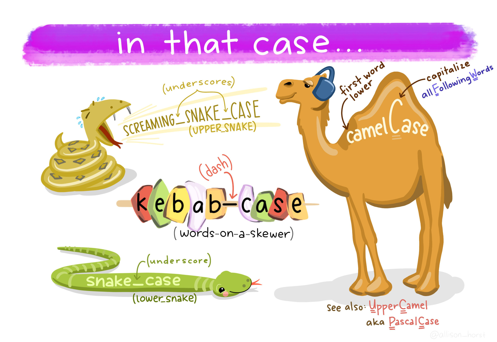

# File Directory Organization {#organization}

## File Naming

When creating file names, best practices dictate that you should:

- Create meaningful but brief names;
- Use file names to classify types of files 
  - ex: `20230131_DTLA_RA.csv` file name classifies this file as Rapid Assessment vegetation monitoring data  from the Desert Tortoise Linkage Area and was created on Jan. 31, 2023;
- Avoid using spaces, dots and special characters (ex: & or ? or !);
- Use capital letters to delimit words, not spaces or underscores for data files, *as much as possible* (ex: 20170217_CVStormwaterVAP.csv);

```{r case, echo = F, auto_pdf = TRUE, fig.align = 'center', fig.height = 2, fig.cap= "Types of font cases (L to R, clockwise): Screaming Snake Case, Camel Case, Upper Camel, Snake Case, Kebab Case. Art Credit: Dr. Allison Horst, UCSB"}


```

- Use hyphens (-) or underscores (_) to separate elements in a file name for documents;
- Always use the [ISO 8601](https://www.iso.org/iso-8601-date-and-time-format.html) date format in file names: **YYYYMMDD**. For example, in the file name *20230131_DTLA_RA.csv* January 31, 2023 is represented as **20230131**;
- Preserve the 3-letter file extension for application-specific codes of file format (e.g. .doc, .xls, .mov, .tif);
- With sequential numbering (e.g., 1, 2, 3, etc.), use leading zeros to accommodate multi-digit versions. For example, use 01-10 for 1-10, 001-100 for 1-100, and so on;
- Include versioning of file names where appropriate (ex: filename_rev20230131.doc).

- Order the elements in a file name in the most appropriate way to retrieve the record. For example, 
  - file name with the date, 
  - the project name (or acronym) or project location should be first, 
  - then the type of data or file (either RA or Report),
  - then version or author,
  - **Examples:** `20170217_CVStormwaterVAP.csv`, `20221231_CVMC_CRCA01_Proposal_LCS.doc`


## Folder Organization


## Data Management