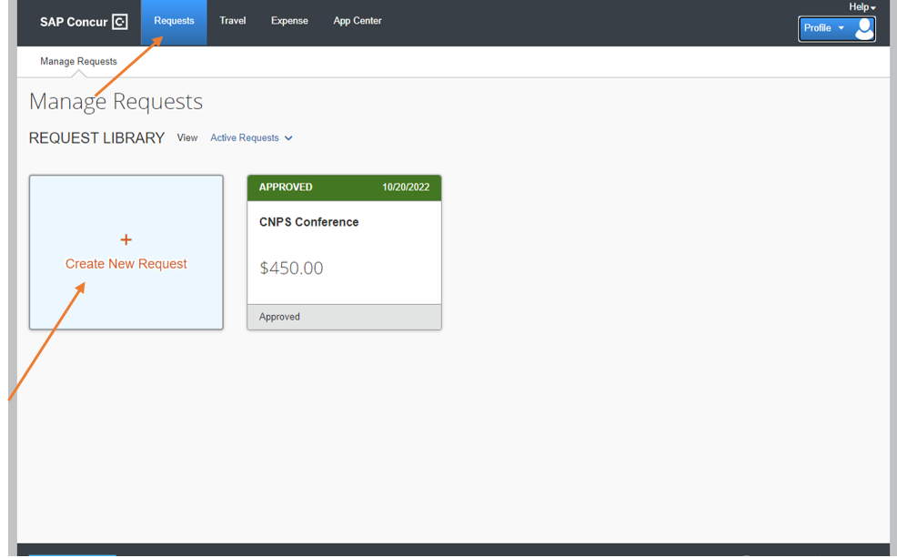
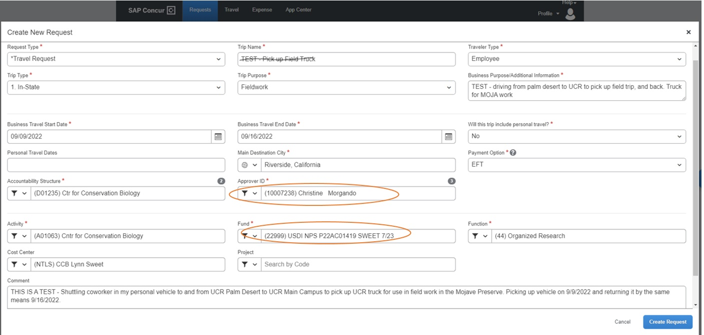
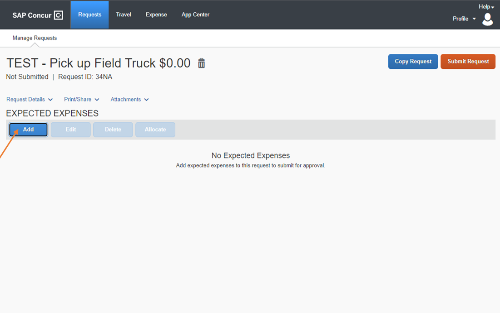
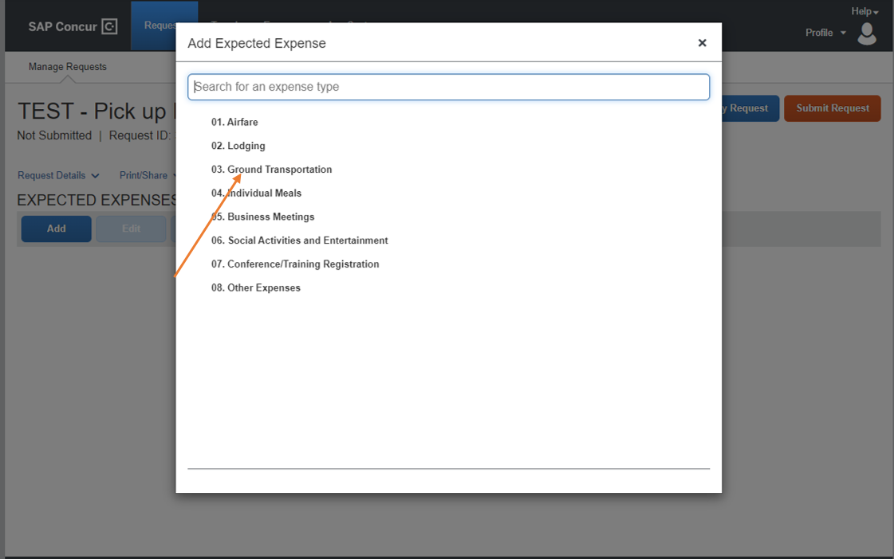
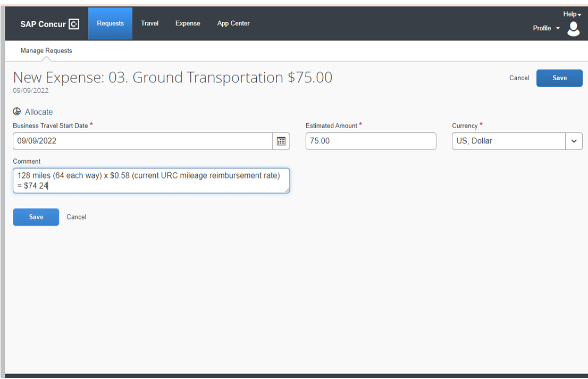
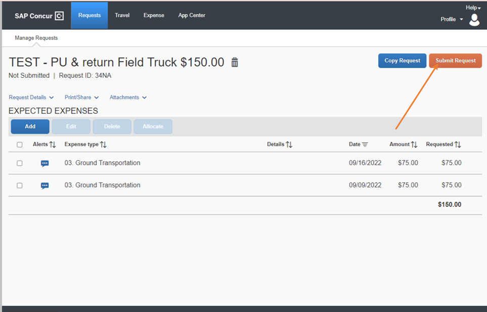

# Concur Travel {#concur}

UCR provides reimbursements for travel, lodging, and meals associated with travel for work. All travel must be discussed and approved by the PI (Lynn Sweet)


The new Concur Travel system has a modern, mobile-friendly user interface with built-in business rules to check for completeness prior to submitting an Expense Report.  Please remember that, even though the travel application is changing, the UC travel policy is not and the Expense Report in the new Concur Travel system will still require a business purpose and itemized receipts for travel expenses.  And, similar to the old iTravel system, the new Concur Travel system will allow only the Traveler to approve a Declaration of Missing Evidence (DME) and *only* the Traveler can submit an Expense Report. 


The new Concur Travel system uses a two-step process:

1 - Submitting a Trip Request prior to travelling

2 - Submitting an Expense Report after your trip is complete (Please note that BMPN Travel Arrangers can assist with training for this step)

*Note* You can reach out to the BMPN Travel Arrangers (Sarah Acrey, Jeanette Westbrook, or Elisha Hankins) for assistance in completing your first Expense Report in Concur Travel.  Please also note that at this time travel arrangers are not made aware when a trip has been requested or expense report submitted. While campus works to create a report, I ask that you please send a quick email to BMPNPurchasing@ucr.edu to notify us that you have a travel pending review to prevent delays in processing.


## Submitting a Trip Request - *Before the trip*

First, you will need to log into the Concur Travel system. 

-Log into your UCR Portal - https://portal.ucr.edu/.

-Navigate to Authorized Apps, then select the icon for Concur Travel and Expense.

-Log in with your verified UCR email address, the one associated with your UCR account, and sign in with university credentials 


### Make a Trip Request Profile

-Select *Requests* on the upper right of the home page

-Select *Create New Requests* in the center of the page

-Fill out the appropriate information for the request

-Click *Create New Request*


```{r concur1, echo = F, auto_pdf = TRUE, fig.align = 'left', out.width= "75%"}


```


*IMPORtANT NOTE*

-Trip Name must follow this format: Request ID - Travel start date - Travel end date (ex 34kf – 082822 – 090122). If you cannot find the Request ID, you can add it to the name after you have made the request under the title

-‘Fund’ is the FAU number. For the appropriate FAU see the Trello tab with current codes 

-Cost center might change based on projects (*NTCB* is for projects where Cam was the PI when they were created and *NTLS* is for projects where Lynn is the PI), 

-Approver ID is 'Christine Morgando'.


```{r concur2a, echo = F, auto_pdf = TRUE, fig.align = 'left', out.width= "75%"}


```


### Adding Expenses to the Trip Request 

-Select the *Add* button under Expected Expenses

```{r concur3, echo = F, auto_pdf = TRUE, fig.align = 'left', out.width= "75%"}


```

-Select *Ground Transportation* (or any other *expected* expenses such as food, lodging, registrations, etc.)

```{r concur4, echo = F, auto_pdf = TRUE, fig.align = 'left', out.width= "75%"}


```

-Create a *New Expense* for the trip

-Fill out the page with estimated amounts you expect for that category and Save
*NOTE: MILEAGE REIBURSEMENT RATE HAS CHANGED, CURRENT RATES CAN BE FOUND [HERE] (https://accounting.ucr.edu/travel-entertainment/mileage-reimbursement-rates)*


```{r concur5, echo = F, auto_pdf = TRUE, fig.align = 'left', out.width= "75%"}


```

-Continue adding expected expenses until you’ve covered your bases, and then submit request.

```{r concur6, echo = F, auto_pdf = TRUE, fig.align = 'left', out.width= "75%"}


```

-Email Debbie Brown (debbie.brown@ucr.edu) with the subject line being the Request ID to notify her that you put in a request so she can approve it

## Submitting an Expense Report - *After the trip*

-From the request page, open the Approved request

-Select Create Expense Report

*THIS IS AS FAR AS I HAVE GOTTEN AS OF 9/9/2022, UPDATES COMING SOON - MEL*


