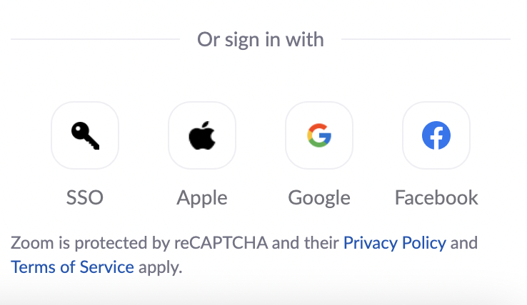

--- 
title: "Center for Conservation Biology | UC Riverside"
subtitle: "Research Unit Resource Guide"
author: 
   - Lynn Sweet | Principal Investigator, Assistant Research Ecologist
   - Julia Parish | Data Science Fellow
date: "`r Sys.Date()`"
site: bookdown::bookdown_site
output: bookdown::gitbook
documentclass: book
bibliography: [book.bib, packages.bib]
biblio-style: apalike
link-citations: yes
github-repo: ccbucr/AdministrationGuide
description: "Documentation on how to install software and tools utilized by the UC Riverside CCB team to facilitate collaborative research."
---

# Welcome to the CCB Research Unit Resource Guide {-}

```{r setup, echo=FALSE, message = FALSE, warning = FALSE}
knitr::opts_chunk$set(echo = F, message = F, warning = F,
                      tidy.opts=list(width.cutoff = 60), tidy = TRUE)

#update.packages(ask = FALSE, checkBuilt = TRUE)  # update R packages
#source directories
#image.dir <- here::here("images")

library(tidyverse)
library(here)
library(kableExtra)
library(knitr)
library(shiny)

# automatically create a bib database for R packages
knitr::write_bib(c(
  .packages(), 'bookdown', 'knitr', 'rmarkdown'
), 'packages.bib')

```

The Center for Conservation Biology (the Center, or CCB) is a University of California Riverside (UCR) organized research unit. Our mission is to assist in the conservation and restoration of species and ecosystems by facilitating the collection, evaluation, and dissemination of scientific information.

This Resource Guide provides an overview of the the UC Riverside CCB research team work processes and expectations. It hosts documentation on how to install software and project management tools utilized by the CCB team to facilitate collaborative research.

If you have suggestions for additions or changes, please make a pull request  or contact Lynn Sweet (lynn.sweet AT ucr.edu).

```{r cima, auto_pdf = TRUE, fig.height = 4,fig.alt="Joshua Tree forest with a cloudless light blue daytime sky with waxing gibbous moon and mountains in the background."}


```

East of Cima Dome in the Mojave National Preserve, California. <br>
**Image Credit:** Center for Conservation Biology 


```{r logos, auto_pdf = TRUE, fig.align = 'center', fig.height = 4, fig.alt="Logo for the University of California Riverside and the Center for Conservation Biology UC Riverside Palm Desert"}

knitr::include_graphics("images/ucrccb.png")
```


<!--chapter:end:index.Rmd-->

# Introduction {#intro}

This is an installation and account set up reference guide for the Center for Conservation Biology team. Team members may contribute to this reference file as we expand the tools utlizied during research efforts.

## Computer requirements

Work computers (laptop or desktop) operating systems should either be Windows or macOS. Please note that Windows based machine it required to run ESRI ArcDesktop and ArcPro software. Both Windows and macOS may utilize ESRI ArcOnline tools. 

For **Mac** users, update macOS to the newest supported version. Navigate to System Preferences --> Software Update.

For **PC** users, ensure you have Windows 10 or 11 installed. If not, request a Windows key from UCR IT at [UC Riverside ServiceLink](https://ucrsupport.service-now.com/ucr_portal?id=ucr_home)

## Software

Software covered in this reference guide includes:

- git
- GitHub
- Google Apps
- R
- RStudio
  - Quarto
  - Bookdown
- Slack
- Trello
  - Trello 4 Slack
- Zotero


_________________________________________________________

Thank you to UC Santa Barbara's Bren School of Environmental Science & Management and National Center for Ecological Analysis and Synthesis (NCEAS) staff for providing many of the resources listed in this reference guide. Information was made available on the [UCSB-MEDS GitHub page](https://github.com/UCSB-MEDS).

<!--chapter:end:01-intro.Rmd-->

# R and RStudio Installation {#r}

## Install or Update R 

**R** is a programming language and environment used for statistical computing and grahics. For more information, please visit [What is R](https://www.r-project.org/about.html).

To install R, visit [cloud.r-project.org](https://cloud.r-project.org/) to download the most recent version for your operating system.

## Install or Update R Studio

RStudio is a software (considered an Integrated  Development Environment, or IDE) that provides R programmers with an easy-to-use interface for coding in R. 

**Note:** RStudio will not work without R installed, and you won’t particularly enjoy using R without having RStudio installed. Be sure to install both!

- **New install:** To install RStudio, visit [rstudio.com/products/rstudio/](https://www.rstudio.com/products/rstudio/). Download the free (“Open Source Edition”) Desktop version for your operating system. 

- **Update:** If you already have RStudio and need to update: Open RStudio, and under ‘Help’ in the top menu, choose ‘Check for updates.’ If you have the most recent release, it will return ‘No update available. You are running the most recent version of RStudio.’ Otherwise, you should follow the instructions to install an updated version.

Open RStudio (logo you’ll click on shown below). **If you are prompted to install Command Line Tools, do it.**

```{r rstudio, auto_pdf = TRUE, fig.align = 'center', fig.height = 6, fig.alt="Image of R Studio logo, which is a white captial R encased in a light blue circle."}

knitr::include_graphics("images/rstudio.png")
```


**Mac Users**

There may be a need to install command line tools and [XQuartz](https://www.xquartz.org/):

- To install command line tools (if you’re not automatically prompted), run in the Terminal tab in RStudio: `xcode-select --install`

- Visit [xquartz.org](https://www.xquartz.org/) to download & install XQuartz.

## Install Quarto

*This is an optional tool within R Studio that is extremely powerful, but it is not required.*

Quarto is a scientific publishing tool built on Pandoc that allows R, Python, Julia, and ObservableJS users to create dynamic documents, websites, books and more.

As of *July 2022*, Quarto comes pre-installed in R Studio (v2022.07). If you haven't updated your R Studio IDE (and concerned about doing so), you can install Quarto separately. 

- Download Quarto [here](https://quarto.org/docs/get-started/) and install

- To use Quarto through the RStudio IDE, be sure to have at least version v2022.02 installed (see directions in step 2, above)

Learn more about Quarto [here](https://quarto.org/docs/get-started/hello/rstudio.html).

## Learn How to Use R & RStudio

There are a lot of resources out there to help you learn how to use R and the RStudio IDE (YouTube, Googling, [StackOverflow](https://stackoverflow.com/), etc...). This is a short list of primary resources for you to reference. It is highly recommended to join R community Slack channels, R User community groups (such as [R-Ladies](https://rladies.org/)), and UC Riverside Data Science clubs!

- [ACM at UCR](https://acmucr.org/index.html) - UC Riverside community dedicated to technical, professional, and personal development in the context of computer science.
- [R for Data Science](https://r4ds.had.co.nz/)
- [R Markdown Cookbook](https://bookdown.org/yihui/rmarkdown-cookbook/)
- [Cookbook for R](http://www.cookbook-r.com/)
- [Advanced R](https://adv-r.hadley.nz/)
- [R Studio (posit) Book Catalog](https://www.rstudio.com/resources/books/)
- [R for Data Science Online Learning Community](https://www.rfordatasci.com/)
- [R OpenSci](https://ropensci.org/)
- [RStudio Cloud](https://rstudio.cloud/learn/primers) - interactive tutorials to learn data science basics.
- [R Studio Cheatsheets](https://www.rstudio.com/resources/cheatsheets/) - invaluable tool to learn how to use various R packages. 
- [Swirl](https://swirlstats.com/) - R package that is a built in tutorial.
- [Teacups, Giraffes, & Statistics](https://tinystats.github.io/teacups-giraffes-and-statistics/index.html) - an interactive tutorial to learn statistics and R coding, plus it is a beautiful!
- [Data Science in a Box](https://datasciencebox.org/)
- [Adventures in R](https://www.adventures-in-r.com/)
- [Data Analysis & Visualization in R for Ecologist](https://datacarpentry.org/R-ecology-lesson/)


<!--chapter:end:02-r_rstudio.Rmd-->

# Bookdown Guide {#bookdown}

The first step to edit and add to this bookdown is to install the **bookdown** package from CRAN or Github. In the RStudio console, run the following:

```{r, eval=FALSE, echo = TRUE}
install.packages("bookdown")
# or the development version
# devtools::install_github("rstudio/bookdown")
```

## Primary Reference Resources

Here is a list of resources to learn how to use and edit in bookdown

- [Bookdown Package Documentation](https://bookdown.org/)
- [Authoring Books with R Markdown](https://bookdown.org/yihui/bookdown/)
- [R Markdown Cookbook](https://bookdown.org/yihui/rmarkdown-cookbook/)
- [R Markdown: The Definitive Guide](https://bookdown.org/yihui/rmarkdown/)

__________________________________________________________________________________

**The following information is directly taken from the _bookdown_ package** [@R-bookdown].

## Formatting

You can use anything that Pandoc's Markdown supports, e.g., a math equation $a^2 + b^2 = c^2$.

Remember each Rmd file contains one and only one chapter, and **a chapter** is defined by the first-level heading `#`.

You can label chapter and section titles using `{#label}` after them, e.g., we can reference Chapter \@ref(intro). If you do not manually label them, there will be automatic labels anyway, e.g., Chapter \@ref(methods).

Figures and tables with captions will be placed in `figure` and `table` environments, respectively.

```{r nice-fig, fig.cap='Here is a nice figure!', out.width='80%', fig.asp=.75, fig.align='center'}
par(mar = c(4, 4, .1, .1))
plot(pressure, type = 'b', pch = 19)
```

Reference a figure by its code chunk label with the `fig:` prefix, e.g., see Figure \@ref(fig:nice-fig). Similarly, you can reference tables generated from `knitr::kable()`, e.g., see Table \@ref(tab:nice-tab).

```{r nice-tab, tidy=FALSE}
knitr::kable(
  head(iris, 20), caption = 'Here is a nice table!',
  booktabs = TRUE
)
```

## Citations

You can easily write citations using .bib files within this repository formatted using [BibTEX](http://www.bibtex.org/). For example, the **bookdown** package [@R-bookdown] in this reference book, which was built on top of R Markdown and **knitr** [@xie2015].

## Alt Text for Accessibility

[Use the knitr package to add alt text to graphics in R Markdown files](https://www.rstudio.com/blog/knitr-fig-alt/)

## Rendering Bookdown to Build & Publish

In your Console, type either of these commands depending on which type of render you prefer:

`bookdown::render_book("index.Rmd", "bookdown::gitbook")`
`bookdown::render_book("index.Rmd", "bookdown::pdf_book")`

To compile to PDF, you need XeLaTeX. It is recommended to install TinyTeX (which includes XeLaTeX): <https://yihui.name/tinytex/>.

<!--chapter:end:03-bookdownGuide.Rmd-->

# Git Installation & GitHub Account {#git}

## Git

Check to see if your computer already has git:

- Open RStudio
- In the terminal, run the following command:

`which git`

If `git` is already installed, the return to the above command should return a filepath (ex: `/usr/local/bin/git`). 

- If there is no response, download and install `git` from here: [git-scm.com/downloads](https://git-scm.com/downloads). Select the default settings within the prompts **except** the default to **master** branch. This branch is being phased out, so select the option that let's you select alternative branches (ex: main).

## GitHub

GitHub is a internet based code hosting platform for collaboration and [version control](https://www.atlassian.com/git/tutorials/what-is-version-control#:~:text=Version%20control%2C%20also%20known%20as,to%20source%20code%20over%20time.). GitHub lets you (and others) work together on projects.

Navigate to [github.com](https://github.com/), and create an account! Please use either your work or personal email account. You can add several emails to your account, and assign a particular email as the primary email for the account. 

Review this article on choosing a GitHub username: [happygitwithr.com/github-acct.html](happygitwithr.com/github-acct.html). 

Once you have created a GitHub account, join the [CCB's GitHub Organization](https://github.com/ccbucr). Please email the CCB PI to request they invite you to the organization. 

## Configure Git 

Once Git is installed and your GitHub account has been set up, Git needs to be configured on the computer. Configuring Git is required to push & pull commits to GitHub. 

- In RStudio, open the terminal. 
- Run the following commands separately, pressing `Enter` after each line. Replace username and email with your GitHub account username and email. Make sure to keep the quotes around the username in the code below: 

  - `git config --global user.name "Jane Doe"`
  - `git config --global user.email janedoe@example.com`
  
- Once you have entered the above command line code, check that the configuration was set correctly. In the RStudio Terminal, type the following command and hit enter:
  - `git config --list --global`
  
In the terminal, it should show code similar to this in the Terminal:

`user.name=janedoe`
`user.email=janedoe@ucr.edu`
`core.excludesfile=/Users/janedoe/.gitignore`

If when installing or updating Git, the default branch was not set to `main` (it is defaulting to the old `master` branch), you can change this setting globally. In the Terminal again, enter the line below:

`git config --global init.defaultBranch main`

For more information on configuring Git: [check out this Git reference](https://git-scm.com/book/en/v2/Getting-Started-First-Time-Git-Setup)

## Personal Access Token

Once Git has been configured to commit to your GitHub account, a **Personal Access Token (PAT)** must be created for **each computer you intend to use**. A PAT is an alternative password authentication method for Git to access GitHub accounts.

- In the RStudio Console, install the [`usethis`](https://usethis.r-lib.org/) package in R by running the following code:

`install.packages("usethis")` 

If the `usethis` package is installed correctly, at the end of the stream of text there should be a message similar to the image below:

```{r usethis, echo = F, auto_pdf = TRUE, fig.align = 'left', fig.height = 3, fig.alt="Installation download message in RStudio console that reads The downloaded binary packages are in this file path."}

knitr::include_graphics("images/usethis.png")
```

- Once the `usethis` package is installed, run the following in the RStudio Console:

`usethis::create_github_token()`

  - Enter your GitHub password when prompted. 
  
This should take you to the **Settings/Developer settings** section of your GitHub account:

```{r pat, echo = F, auto_pdf = TRUE, fig.align = 'left', fig.height = 3, fig.alt="Image of GitHub settings webpage."}

knitr::include_graphics("images/pat.png")
```

- **Note Field**

Change the PAT name to a meaningful reference (see image for an example). You may end up creating multiple PATs, so you want to ensure that you know which PAT is designated for each computer | server. 

- **Expiration Field**

This is to select a set expiration timeframe for your PAT. Setting an expiration is highly recommended, and GitHub will send you *SEVERAL* emails prior to it expiring to remind you to renew it. Use the drop down to select a set time frame (7 days to 90 days) or create a custom expiration time frame (exactly a year or particular date).

- **Select Scopes Field**

Define access for the Personal Access Token being generated. 

It is recommended to select at least the following scopes:
  - repo
  - workflow
  - write:packages
  - notifications
  - delete repo
  - write:discussions
  - project

To learn more about Scopes, visit [the GitHub Scopes for OAUth Apps page](https://docs.github.com/en/developers/apps/building-oauth-apps/scopes-for-oauth-apps).

- Once Scopes are selected, click on the green `Generate token` button: 

```{r generatepat, echo = F, auto_pdf = TRUE, fig.align = 'center', fig.height = 3}

knitr::include_graphics("images/generatepat.png")
```

   - Copy the generated PAT to your clipboard.
   - Paste and Save this PAT in a text file in a secure folder that will NEVER be accessed by other users or the internet. You can create a `private` folder on your personal computer to store these files. 

- Return to RStudio Console and run the following command:

`gitcreds::gitcreds_set()`.

You will be prompted to paste the PAT into the console:

```{r pastepat, echo = F, auto_pdf = TRUE, fig.align = 'center', fig.height = 3}

knitr::include_graphics("images/paste_pat.png")
```

Paste the PAT at the end of the line `Enter password or token:` and press enter.

- In the console, run:

`usethis::git_sitrep()`

This command should return your GitHub account information (see example below).


```{r gitsitrep, echo = F, auto_pdf = TRUE, fig.align = 'center', fig.height = 3}

knitr::include_graphics("images/gitsitrep.png")
```

For more information on PATs, check out [GitHub's PAT information page](https://docs.github.com/en/authentication/keeping-your-account-and-data-secure/creating-a-personal-access-token). 

<!--chapter:end:04-git_github.Rmd-->

# Project Management Tools {#projmgmt}

## UCR VPN - GlobalProtect

UC Riverside provides free access to a Virtual Private Network (VPN), GlobalProtect, that allows you to access the CCB NAS Server or campus resources (ex: library services) when working remotely.

To install and use the GlobalProtect VPN, navigate to the UCR ServiceLink [GlobalProtect Connection Installation Instructions](https://ucrsupport.service-now.com/ucr_portal/?id=kb_article&sys_id=8a264d791b5f0c149c0b844fdd4bcb34).

## Google Apps

The CCB team utilizes a number of Google applications for project management, data & file sharing, and communicating with colleagues. 

**Google Calendar:** There is a lab Google calendar, *UCR CCB Palm Desert*. This calendar maintains lab mates work and leave schedules as well as any team meetings. Please make sure this calendar is shared with you once you have obtained your UCR NetId. 

**Google Drive:** CCB utilizes *Shared Drive* folders as a file sharing application. You must request access to the shared drive folder from the lab P.I. 

**Google Sites:** There is a [CCB Google Site](https://sites.google.com/ucr.edu/ccbucr/home) that is in draft form at the moment. This site may serve as an intranet or provide public facing information in the future. 

## Microsoft 360 Suite

UCR provides free access to Microsoft Office 365 Pro Plus for faculty, staff, and students! Please note that the available applications differ between PC and Mac OS. To learn more about downloading Microsoft applications, please visit the 
[UC Riverside Microsoft 360 information page](https://ucrsupport.service-now.com/ucr_portal/?id=kb_article&sys_id=0868da980f602f0086b7c7dce1050ee0). 

Microsoft 360 training resources can be found [here](https://support.microsoft.com/en-us/training).

## Trello

```{r trello, echo = F, auto_pdf = TRUE, fig.align = 'left', fig.height = 3, fig.alt="Image of Trello logo, blue 3 bold blue lines and trello in black font."}

knitr::include_graphics("images/trello.png")
```

[Trello](https://trello.com/en) is a project management app tool that provides teams the opportunity to create task lists, reference & resource lists, and communicate via tagging! To connect with CCB's Trello Workspace, send a request to CCB's PI. The main board is **CCB Team Projects**.


## Zotero

The Center for Conservation Biology shares research references through Zotero software. Zotero is a citation management tool and allows groups to collect and share references easily. The Zotero browser extension makes it easy to copy citations from webpages. 

To install Zotero and the extension, please follow UC Riverside's installation instructions [here](https://guides.lib.ucr.edu/c.php?g=171064). *Note*: These instructions are for a **Windows** machine, but it is a similar process for Macs. 

```{r zotero, echo = F, auto_pdf = TRUE, fig.align = 'center', fig.height = 6}

knitr::include_graphics("images/zoteroinstall.png")
```


```{r zoteroextension, echo = F, auto_pdf = TRUE, fig.align = 'center', fig.height = 6}

knitr::include_graphics("images/zoteroextension.png")
```

The next step is to create a Zotero account and enable syncing to enable extension use and to be able to join the [CCB Zotero Reference Group](https://www.zotero.org/groups/4734848/ccbucr). Make sure to use your using the UCR email address when setting up the Zotero account. 

```{r zoterosyncing, echo = F, auto_pdf = TRUE, fig.align = 'center', fig.height = 6}

knitr::include_graphics("images/zoterosyncing.png")
```

To connect to the CCB Zotero Reference Group, navigate to [this link](https://www.zotero.org/groups/4734848/ccbucr). If you do not have access to the Group page, please send a request that you be added to the CCB PI.

For more information on how to use Zotero, check out these links:

- [UC Riverside Zotero Tips & Tricks](https://guides.lib.ucr.edu/c.php?g=171064&p=1126842)
- [Zotero Quick Start Guide](https://www.zotero.org/support/quick_start_guide)
- [Zotero Groups](https://www.zotero.org/support/groups)
- [RStudio Citations](https://www.youtube.com/watch?v=zuuOYjE8m98) - add BibTex citation format in Zotero then quickly use .bib files in R to create references in markdown. 

## Zoom

Zoom is a great tool to schedule virtual meetings, and the CCB hosts Zoom-based team meeting regularly. UC Riverside provides all faculty, staff, and students a free premium account. In order to utilize this service, download the application and sign in via Single Sign-ON (SS0). For the most current installation and log in information, visit UC Riverside's [Information Technology Systems Zoom account page](https://its.ucr.edu/blog/2019/12/17/changes-ucr-zoom-account-access).

- **Step 1**: Download the Zoom application via [UC Riverside's Zoom service page](https://ucr.zoom.us/) - just select the **Download** button!

```{r zoomdownload, echo = F, auto_pdf = TRUE, fig.align = 'center', fig.height = 2, fig.alt="Image of UC Riverside's Zoom Service page that has 4 buttons that prompts users to either Sign In, Sign In, Download, Join, Host."}


```


- **Step 2**: Once the application is downloading, Zoom will automatically open. You will be prompted to either *Join a Meeting* or *Sign In*. Select *Sign In* and set up your UCR Zoom account using your NetId information. 

- **Step 3**: Click the *Sign In with SSO* button, then enter `ucr` in the *company domain* section. 

```{r sso, echo = F, auto_pdf = TRUE, fig.align = 'center', fig.height = 2, fig.alt="Image of Zoom Account Sign In prompt displaying 4 buttons: SSO, Apple, Google, Facebook"}


```

```{r domain, echo = F, auto_pdf = TRUE, fig.align = 'center', fig.height = 2}

knitr::include_graphics("images/zoomdomain.png")
```

- **Step 4**: You will then be prompted to sign in, this time using your UCR NetId. The program may open up an authentication window requesting your UCR NetId as shown below:

```{r zoomcred, echo = F, auto_pdf = TRUE, fig.align = 'center', fig.height = 2}

knitr::include_graphics("images/zoomcred.png")
```

- **Step 5**: Personalize your Zoom account! You can add your name, pronouns, and an image to your profile, create a *personal Zoom room* to utilize as a default meeting space, and set settings like *mute all participants when they join a meeting* or turn off settings such as *start meetings with participant video on. Participants can change this during the meeting.*

Happy Zooming! 

**Zoom Resources:**

- [Zoom Help Desk](https://support.zoom.us/hc/en-us)
- [Zoom meetings trainings](https://livetraining.zoom.us/rec/play/6Zx8f-j7qDw3GNeQswSDAPJ-W9S4J6qshiYfqfcNyk20WyIHNFChb7pHZuClKrDVR76R1BxgtMF4txaS?continueMode=true)
- [UC Riverside Zoom Services](https://ucr.zoom.us/)

## Slack

```{r slack, echo = F, auto_pdf = TRUE, fig.align = 'left', fig.height = 0.5, fig.alt="Image of Slack logo, light blue, bright green, red, and mustard yellow symbol with lower case slack spelled out in black font."}

knitr::include_graphics("images/slack.png")
```

Slack is a messaging app that connects teams via channels and direct messages (DMs). To make the most of this team communication tool, you will need to download the application to your desktop, have the application open throughout the workday, and adjust the notification settings to your preferences to receive timely alerts.

### Download the Slack app

- For Windows: download Slack [here](https://slack.com/downloads/windows).
- For Macs: download Slack [here](https://slack.com/downloads/mac).
- Consider adding the app to your Android or iOS device(s) for mobile communication with the CCB team! 

### Join the CCB_UCR Slack Workspace

Follow [this link](https://join.slack.com/t/ccbucr/shared_invite/zt-1dfpaguqs-F4CAPCI4ILMvT0JOcSpnag) to join the CCB Slack workspace. Once you have joined, you will be automatically be added to several workspace channels: 

- `#general`: a channel for general announcements and team-wide conversations
- `#how_to_slack`: a channel for tips for how to best use Slack and its apps, as well as a space for the team to ask questions re: how to best utilize this communication tool. Check out the `pinned` messages and `bookmarked` websites.
- `#meetings`: a channel for announcing meetings and sharing resources for team meetings.
- `#random`: a channel to share random news, updates, ideas, jokes, etc.

### Slack Resources 

Check out Slack's [**Top 5 tips for getting started in Slack**](https://slack.com/intl/en-in/resources/using-slack/top-5-tips-for-getting-started-in-slack) (5 min read) to learn the app's basic functions and communication workflows. The [Slack help center](https://slack.com/help/articles/360059928654-How-to-use-Slack--your-quick-start-guide) has useful *how to* guides and [tutorials](https://slack.com/help/articles/360059976673-Slack-video-tutorials) to facilitate working in Slack. 

**Slack Apps**

- A **Trello app** is incorporated in the CCB_UCR Slack workspace. You can create cards in Slack for the CCB Team Projects Trello workspace. To learn how, [follow this Slack connect tool](https://slack.com/help/articles/231967387-Trello-for-Slack).
- The **Zoom app** can be added to Slack that allows your to start or join a Zoom Meeting or Zoom Phone call by using the **“/zoom”** slash command in any Slack channel or message.
- Add the **Google Drive app** to Slack to share resources from the CCB Shared Drive. 
- There is an app for **Microsoft Teams** which allows a Teams video call from Slack. 
  - Start a Teams video call right from Slack
Launch a call in Slack with the /teams-calls slash command. Before joining, get a quick glance at who’s already on the call and when the call kicked off.
  - Jump from Slack straight into a meeting — join Teams meetings directly from calendar reminders in Slack, using the Outlook or Google Calendar apps.
  - Customize call settings for your team. Set Microsoft Teams Calls as your default calling provider, so anyone can start a video call in Teams with a quick click of the phone button in Slack.

Other cool Slack workspaces to join:

- [EcoDataScience](https://eco-data-science.github.io/) - an environmental data science study group that started at UC Santa Barbara, but now has an international following!

- [R4DS Online Learning Community](https://www.rfordatasci.com)

- [Society for Open, Reliable, and Transparent Ecology and Evolutionary Biology (SORTEE)](https://www.sortee.org)

<!--chapter:end:05-projectmgmttools.Rmd-->

# ESRI GIS Platform {#esri}

## ESRI ArcGIS

UC Riverside provides free access to ESRI ArcGIS software and platforms for faculty, staff, and students. Learn more about these data analysis and visualization tools [here](https://ucrsupport.service-now.com/ucr_portal?id=sc_category&sys_id=e9b36a7e1b691c10eab58734ec4bcb78&catalog_id=-1).

**ESRI Platform Software**

- ESRI ArcGIS Desktop: a proprietary desktop GIS software suite that allows you to create maps, perform spatial analysis and manage data. Required software for installation: Microsoft .NET (aka a PC machine), Python 2.7+. 
- ESRI ArcGIS Pro: ArcGIS Desktop is transitioning to ArcGIS Pro, an interactive spatial data visualization tool that allows users to create 2D maps, 3D scenes, and share projects on ArcGIS Online. Training resources for ArcGIS Pro are [here](https://www.esri.com/en-us/arcgis/products/arcgis-pro/resources).
- ESRI ArcGIS Online: This is cloud-based software that runs on any device with an internet connection. It allows users to easily publish maps on-line, access other UCR spatial products, and create spatial data dashboards and hubs. Check out [UCR ArcGIS Online](https://ucr.maps.arcgis.com/home/index.html).


### Install ESRI ArcGIS software

- Step 1: Navigate to the [UCR Portal ServiceLink Software Catalog](https://ucrsupport.service-now.com/ucr_portal). 

- Step 2: Under the Information Technology section, select **Request Services & Software** link.

```{r servicelink, echo = F, auto_pdf = TRUE, fig.align = 'center', fig.height = 3, fig.alt="Screen shot of UCR ServiceLink homepage information technology section."}


```

- Step 3: Scroll down to the **Software Request** card and select link.  

```{r softwarerequest, echo = F, auto_pdf = TRUE, fig.align = 'left', fig.height = 3}

knitr::include_graphics("images/softwarerequest.png")
```

- Step 4: Complete the Software Request form using your UCR NetId and UCR email, then select **Submit**. 

```{r requestsubmit, echo = F, auto_pdf = TRUE, fig.align = 'center', fig.height = 3}

knitr::include_graphics("images/requestsubmit.png")
```

- Step 5: The UC IT team will send email notifications to provide further instructions. 

### ESRI Resources

Here are few resources that provide tutorials and workshops on how to use ESRI software:

- **ESRI Academy**: Search the ESRI Acadmey [Course Catalog](https://www.esri.com/training/) for MOOCs, Tutorials, and Web Courses. 
- **UC ANR IGIS** - the [UC Agriculture and Natural Resources Informatics & GIS Program](https://igis.ucanr.edu/Training/) host ESRI ArcGIS training webinars and virtual workshops throughout the year. 
- **LinkedIn Learning** - Through [UCR LinkedIn Learning](https://www.linkedin.com/learning/topics/arcgis?u=26135898), users may take ESRI ArcGIS courses and learning paths.

<!--chapter:end:06-esri.Rmd-->

# File Directory Organization {#organization}

## File Naming

When creating file names, best practices dictate that you should:

- Create meaningful but brief names;
- Use file names to classify types of files (ex: DTLA_RA_20230131.csv);
- Avoid using spaces, dots and special characters (& or ? or !);
- Use capital letters to delimit words, not spaces or underscores for data files, *as much as possible* (ex: CVStormwaterMasterVAP20170217.csv);
- Use hyphens (-) or underscores (_) to separate elements in a file name for documents;
- Always use the [ISO 8601](https://www.iso.org/iso-8601-date-and-time-format.html) date format in file names: **YYYYMMDD**. For example, in the file name *DTLA_RA_20230131.csv* January 31, 2023 is represented as **20230131**;
- Preserve the 3-letter file extension for application-specific codes of file format (e.g. .doc, .xls, .mov, .tif);
- With sequential numbering (e.g., 1, 2, 3, etc.), use leading zeros to accommodate multi-digit versions. For example, use 01-10 for 1-10, 001-100 for 1-100, and so on;
- Order the elements in a file name in the most appropriate way to retrieve the record. For example, 
  - the project name (or acronym) or project location should be first, 
  - then the type of data or file (either RA or Report),
  - then version or author,
  - end file name with the date,
  - Examples: *CVStormwaterVAP20170217.csv*, *CVMC_CRCA01_Proposal_LCS_20221231.doc*;
- Include versioning of file names where appropriate (ex: filename_rev20230131.doc).


## Folder Organization


## Data Management

<!--chapter:end:07-filedirectory.Rmd-->

`r if (knitr:::is_html_output()) '
# References {-}
'`

<!--chapter:end:08-references.Rmd-->

