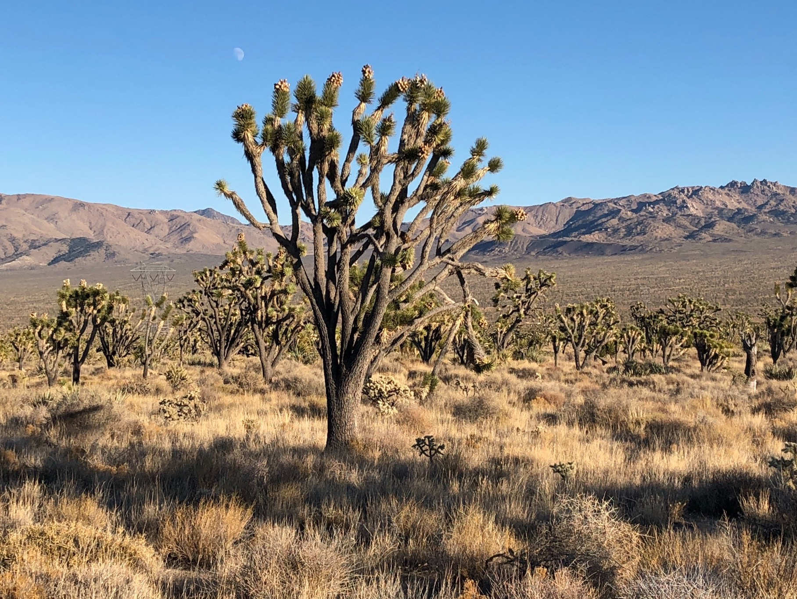

--- 
title: "Center for Conservation Biology | UC Riverside"
subtitle: "Research Unit Resource Guide"
author: 
   - Lynn Sweet | Principal Investigator, Assistant Research Ecologist
   - Julia Parish | Data Science Fellow
date: "`r Sys.Date()`"
site: bookdown::bookdown_site
output: bookdown::gitbook
documentclass: book
bibliography: [book.bib, packages.bib]
biblio-style: apalike
link-citations: yes
github-repo: ccbucr/AdministrationGuide
description: "Documentation on processes utilized by the UC Riverside CCB team to facilitate collaborative research."
---

# Welcome to the CCB Research Unit Resource Guide {-}

```{r setup, echo=FALSE, message = FALSE, warning = FALSE}
knitr::opts_chunk$set(echo = F, message = F, warning = F,
                      tidy.opts=list(width.cutoff = 60), tidy = TRUE)

#update.packages(ask = FALSE, checkBuilt = TRUE)  # update R packages
#source directories
#image.dir <- here::here("images")

library(tidyverse)
library(here)
library(kableExtra)
library(knitr)
library(shiny)

# automatically create a bib database for R packages
knitr::write_bib(c(
  .packages(), 'bookdown', 'knitr', 'rmarkdown'
), 'packages.bib')

```

The Center for Conservation Biology (the Center, or CCB) is a University of California Riverside (UCR) organized research unit. Our mission is to assist in the conservation and restoration of species and ecosystems by facilitating the collection, evaluation, and dissemination of scientific information.

```{r cima, auto_pdf = TRUE, fig.height = 4,fig.alt="Joshua Tree forest with a cloudless light blue daytime sky with waxing gibbous moon and mountains in the background."}


```

East of Cima Dome in the Mojave National Preserve, California. <br>
**Image Credit:** Center for Conservation Biology 


```{r logos, auto_pdf = TRUE, fig.align = 'center', fig.height = 4, fig.alt="Logo for the University of California Riverside and the Center for Conservation Biology UC Riverside Palm Desert"}


```

