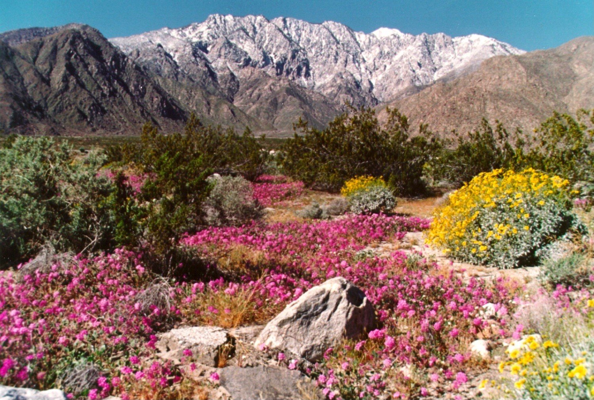

--- 
title: "Center for Conservation Biology | UC Riverside"
subtitle: "Installation Guide"
author: 
   - Lynn Sweet | Principal Investigator, Assistant Research Ecologist
   - Julia Parish | Data Science Intern
date: "`r Sys.Date()`"
site: bookdown::bookdown_site
output: bookdown::gitbook
documentclass: book
bibliography: [book.bib, packages.bib]
biblio-style: apalike
link-citations: yes
github-repo: ccbucr/AdministrationGuide
description: "Documentation on how to install software and tools utilized by the UC Riverside CCB team to facilitate collaborative research."
---

# Informational Resource for Software and Application Installation Utilized by CCB Faculty & Staff {-}

```{r setup, echo=FALSE, message = FALSE, warning = FALSE}
knitr::opts_chunk$set(echo = F, message = F, warning = F,
                      tidy.opts=list(width.cutoff = 60), tidy = TRUE)

#update.packages(ask = FALSE, checkBuilt = TRUE)  # update R packages
#source directories
#image.dir <- here::here("images")

library(tidyverse)
library(here)
library(kableExtra)
library(knitr)
library(shiny)

# automatically create a bib database for R packages
knitr::write_bib(c(
  .packages(), 'bookdown', 'knitr', 'rmarkdown'
), 'packages.bib')

```

```{r chinocanyon, auto_pdf = TRUE, fig.height = 6, fig.alt="Image of China Canyon filled with yellow, pink, red wildflowers in the foreground with snowcapped Coachella Valley mountains in background"}


```

Chino Canyon Wildflowers, Coachella Valley, California. <br>
**Image Credit:** Coachella Valley Mountains Conservancy: *Bill Havert*


```{r logos, auto_pdf = TRUE, fig.align = 'center', fig.height = 4, fig.alt="Logo for the University of California Riverside and the Center for Conservation Biology UC Riverside Palm Desert"}

knitr::include_graphics("images/ucrccb.png")
```

